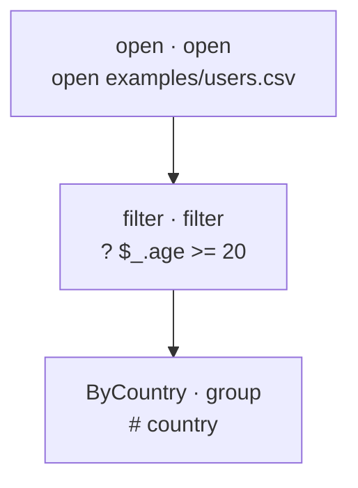

# Rivus — 構文・利用ガイド（日本語版）

Rivus はフロー指向・DAG ネイティブ・ストリーミングのデータランタイムです。
**フロー**（ソース → 変換 → シンク）を記述すると、Rivus がそれをチャンク単位で、
有界メモリで、オプティマイザとライブテレメトリ込みで実行します。

このガイドは実務リファレンスです（完全な構文・全オペレータ・コピペできる例集）。
設計思想は [`docs/design/`](design/README.md)、インストールは [README](../README.md)
を参照してください。

> 🇬🇧 English version: [**`docs/GUIDE.md`**](GUIDE.md)
>
> このドキュメントは英語版ガイドと同じ内容を日本語でまとめたものです。機能を
> 追加する PR では英語版（`GUIDE.md`）と日本語版（このファイル）を必ず同時に
> 更新します。差異を見つけたら英語版が正です。

---

## 1. 10 秒でわかるメンタルモデル

```
Scope:                 # 実行グラフ上の名前付きノード
    open data.csv      # ソース（フローの先頭）
    |? age >= 20       # 変換（フィルタ）
    |> name age        # 変換（射影）
    save out.csv       # シンク
;                      # スコープ終端
```

- プログラムは **スコープ** の集合。`Name: … ;` で 1 つ定義します。
- スコープの最初の行が **ソース**（`open …`）、残りは左から右へ適用される
  **変換** と **シンク** です。
- `|?` `|>` `|#` `|!` はパイプ演算子。`->` `+` `&` で DAG（分岐 / マージ / 結合）を
  組みます。スコープは名前で相互参照できます。
- 空白・改行は意味を持ちません（1 行でも複数行でも可）。`#` は行コメント
  （ただし `|#` はグループ演算子）、`#{ … }#` はブロックコメント。コメントは
  **inert trivia**（実行上の意味なし）ですが **IR に保持**されるので、`rivus fmt`
  で往復します（整形でメモが消えません）。

---

## 2. フローの実行

```sh
rivus run     <program>     # 実行 + 可視化（グラフ・エラー・出力プレビュー）
rivus explain <program>     # DAG IR・オプティマイザレポート・再生成ソースを表示
rivus check   <program>     # 構文チェックのみ（構文エラーを報告）
rivus fmt     <program>     # 正準ソースへ整形（コメントを保持）
```

`<program>` は次の **いずれか**：

| 形式 | 例 |
|---|---|
| ファイル | `rivus run flow.riv` |
| インライン文字列（`-c`） | `rivus run -c 'U: open users.csv \|? age >= 20 ;'` |
| 標準入力（`-`、ヒアドキュメント） | `rivus run - <<'RIV' … RIV` |

フラグ: `--chunk-size N`（チャンクあたり行数、既定 4096）、`--no-opt`
（オプティマイザ無効）、`--json`（ASCII 表示の代わりに機械可読な **JSONL
テレメトリ** を stderr へ — ノード毎・エラー毎・サマリの 1 オブジェクト。stdout
はクリーンなデータのままなので `rivus run flow.riv --json 2>telemetry.jsonl >out.csv`
でデータとメトリクスをきれいに分離できる）、`--telemetry-addr HOST:PORT`
（同じ JSONL をライブ外部ビューア向けに TCP ソケットへ配信。接続失敗時は
stderr にフォールバック）。

**stdout と stderr。** 実行グラフ・テレメトリ・エラーストリームは **stderr** へ、
`save stdout` シンクは **stdout** へクリーンなデータを書きます。だから Rivus は
そのままシェルパイプに差し込めます：

```sh
rivus run -c 'U: open users.csv |? age >= 20 |> name age save stdout as csv ;' | sort
```

### Windows でフローを実行する（引用符・文字コード）

- `datetime("yyMMddHHmmss")` のように `"` を含むフローを `-c` で実行すると
  `cmd`/PowerShell が内側の `"` を取り除き、`datetime(yyMMddHHmmss)` と解釈されて
  `expected a quoted format string` になります。**フローはファイルに保存して
  `rivus run flow.rivus`** で実行してください（あるいはシェル向けに `"` をエスケープ）。
- フロー*スクリプト*の先頭 UTF-8 **BOM は問題ありません**（Rivus が剥がします）。CSV データの
  BOM はそのままで構いません。

---

## 3. ソース（フローの先頭）

| 構文 | 読み込むもの |
|---|---|
| `open PATH` | 拡張子で形式判定（`.csv`→CSV、`.jsonl`/`.ndjson`/`.json`→JSON） |
| `open PATH as FMT` | 形式を強制（`FMT` = `csv` \| `tsv` \| `json` \| `jsonl` \| `ndjson`） |
| `open PATH`（`.tsv`/`.tab`） | **TSV** — タブ区切り、拡張子で判定（std のみ）。`as tsv` で任意パスに強制、`as csv` でカンマに戻す |
| `open PATH.gz` / `PATH.zst` | **圧縮** CSV/TSV — gzip（`.gz`、`--features gzip`）または zstd（`.zst`/`.zstd`、`--features zstd`）。直列・単一パス・有界メモリ。既定（依存ゼロ）ビルドは `rebuild with --features gzip`/`zstd` を促すエラー |
| `open PATH noheader` | ヘッダ行なし CSV — 全行がデータ、列名は `c0, c1, c2, …` |
| `open PATH (col[:type] …)` | **スキーマ宣言**：列名を位置で与え（ヘッダ / `c0…` を上書き）、任意で型を固定 — `int`/`i64`, `float`/`f64`, `str`/`string`, `bool`, `decimal(N)`（厳密固定小数点）, `datetime[("fmt")]`（厳密な時刻）, `duration`（符号付き時間量）, `date`（ISO `yyyy-MM-dd` の暦日）, `time`（`HH:mm:ss` の時刻、§6 参照）。例 `open f.csv (id:int zip:str age)` は `zip` の先頭ゼロを保持。`open sales.csv (id amount:decimal(2))` は `amount` を厳密に読む。`open log.csv (ts:datetime("yyMMddHHmmss"))` は `ts` を時刻として読む |
| `readcsv PATH` | CSV を明示 |
| `readjson PATH` | JSON / JSON Lines を明示 |
| `readbin PATH [le\|be] [packed\|aligned] (name:type …)` | 固定長バイナリレコード（C 構造体ダンプ） |
| `open stdin` / `open -` | 標準入力から CSV（または `as FMT`）を読む |
| `stream NAME` | 名前付きフローを再生（MVP: 参照） |

形式判定は拡張子を **過信しません**。拡張子が嘘をつくときは `open data.dat as json`、
ひと目で分かるようにしたいときは `readcsv`/`readjson` 動詞を使ってください。

**ヘッダ無しファイル：名前と型を同時に。** `open data.csv noheader (id:int name:str
age:int)` で列名と型を同時に与えられます（先頭行はデータとして読まれます）。`noheader`
無しでスキーマだけ与えると**先頭行がヘッダ扱いで消費**されます。先頭行が既にデータなら
`noheader` を付けてください（付けないとその行を失います）。Rivus は支援します：消費した
先頭行が宣言した型から見て**データらしい**場合、`noheader` を付けるよう促す警告を
（沈黙せず）出します。本物のヘッダはそのまま消費するので、既存ヘッダの改名は静かなままです。

**対応形式（現状）:** CSV（引用フィールド対応）、JSON Lines（1 行 1 オブジェクト）、
JSON 配列（`[ {...}, {...} ]`）、固定長バイナリ。JSON/JSONL/NDJSON は同じリーダを
通ります。

**バイナリ例** — `(i32 id, i32 age, f64 score, u8 active)` レコードをデコード：

```
B: readbin dump.bin (id:i32 age:i32 score:f64 active:u8) |? age >= 18 ;
```

`le`/`be` でバイト順を選択（既定リトルエンディアン）、`packed`（既定）vs `aligned`
で C `repr(C)` 自然アライメントのパディングを選択。フィールド型：
`i8 i16 i32 i64 u8 u16 u32 u64 f32 f64 bool`、加えて **`char[N]`** — 固定 `N` バイトの
テキスト欄（C の `char[N]`）を UTF-8 デコードします。**全 `N` バイトを値として保持**
（末尾 NUL／パディングも含む・`char[N]` は 1 バイト境界）。例：
`readbin people.bin (id:i32 name:char[16])` は 16 バイトの名前欄を読みます。

### 来歴（provenance）— `with source` / `with filename`

各行が**どこから来たか**を付与します。任意のソースの後ろに `with source`
（または `with filename`）を付けるだけ。全形式で動きます：

```
open data.csv with source        # 各チャンクに由来ハンドルを載せる
open data.csv with filename       # …さらに `filename` 列を材化する
```

- `with source` は各チャンクに由来**ハンドル**を載せます（列は増えません。
  `source.uri` / `source.scheme` アクセサで取り出す、§6）。既定オフなので、
  素の `open` には一切オーバーヘッドがありません。
- `with filename` は `(source.uri) as filename` のシュガーで、行末に `filename`
  列（ソースパス＝`str`）を付与します。既に `filename` 列がある場合は
  `filename_r`（join と同じ衝突規則）になります。
- 来歴は直列読み・並列読みで**バイト一致**です。どの読み手も同じパスから同じ
  ハンドルを導くため、並列実行は直列のバイト列を厳密に再現します。契約内なのは
  uri のみ（将来の探索が付ける size/mtime は決定性契約の外）。

```
# 各行にファイルを付け、その列を残す
open sales.csv with source |> id amount (source.uri) as src
```

### `ls` — 探索（ファイル一覧をストリーム化）

`ls "glob"` はディレクトリ走査を**フロー**にします。マッチした各ファイルを 1 行
として emit し、通常のストリームと同様に絞る/射影する/後段へ流せます。エイリアス：
`gci`・`dir`。

```
ls "logs/**/*.csv"            # 再帰グロブ → マッチ毎に1行
  |? size > 1000              # ファイルの列で絞る
  |> path name
```

- **グロブ**：`*` / `?` / `[…]` はパスセグメント内、`**` はセグメントを跨いで再帰。
  std 自前（依存ゼロ）・シンボリックリンクは辿りません。**決定的順序**（uri 昇順）、
  0 件マッチ → 警告＋空ストリーム。
- **列**（通常列なので述語/射影がそのまま効く）：

  | 列 | 型 | |
  |---|---|---|
  | `path` | resource | ファイルハンドル（パス/uri として表示。`read` が消費） |
  | `name` | str | ファイル名（basename） |
  | `size` | int | バイトサイズ |
  | `mtime` | datetime | 最終更新時刻 |

- `size` / `mtime` は**決定性契約の外**タグ付き（§0.14）。**同一 run 内は FS が固定**
  なので直列/並列では byte-identity が成立します。タグが効くのは*別 run*間 —
  `interpret == compile`（Phase 2・コンパイル時と実行時で `mtime` が変わり得る）と分散
  実行です。`path`/`name` は決定的です。

> **ハンドルのフィールドは computed column で。** `source.uri`（§6）のようなハンドル
> アクセサは `|> (…)` の中に書きます（例 `|> (source.uri) as p`）。述語に裸の dotted
> フィールド（`|? source.uri == …`）を書くのは**明示エラー**です（曖昧で可逆性も壊れる
> ため）。`ls` では裸の列（`name`/`size`/`path`）をそのまま使ってください。

### `read` — 多数のファイルを 1 ストリームへ

`read [as FMT] [with source|filename]` は **`Resource` 列**（`ls` の `path`、または
`resource(…)` 型の任意の列 — 既定 `path`、無ければ最初の Resource 列）を消費し、各ハンドルを
開いて復号し、**名前で**連結して 1 ストリームにします：

```
ls "sales/2026/**/*.csv" |? size > 0  read as csv with source  |# country sum:amount

# パスのマニフェストでも同じ（read は供給元を問わない）
open manifest.csv |> (resource(filepath)) as path  read with source
```

- **union-by-name**：出力列は全ファイルの列の和（first-seen 出現順）。ある列を持たない
  ファイルはその列が `null`。型は**広い方へ昇格**して切り捨てを防ぎます：`int ⊆ float ⊆
  decimal`、混在は `str`（あるファイルで `int`・別で `float` の列は両方 `float` で読まれる）。
- **`as FMT`** は全ファイルの形式を固定（`csv` / `tsv` / `jsonl`）。無ければ各ファイルの拡張子に
  従います。（現状 CSV + JSONL、binary は後続。）
- **never-silent**：開けない/壊れたハンドルは **quarantine** — error stream に surface して
  スキップし、他のファイルは継続（continue-first）。ファイルは uri 昇順の決定的順で読みます。
- **provenance**：`with source` は各ファイルのハンドルを行に載せ（`(source.uri)` がその行の
  由来ファイル）、`with filename` はさらに `filename` 列を付与します。

### `watch` — ファイル変更の購読（非有界）

`watch "glob"` は `ls` の**非有界**版です：一度だけ一覧するのではなく、OS の変更通知
（inotify / FSEvents / kqueue / ReadDirectoryChangesW）を購読し、glob に合致するファイルが
**作成・変更されるたびに** 1 行を産みます — 終わらないストリームで、列は `ls` と同じ
（`path` / `name` / `size` / `mtime`）なので `read` がそのまま消費できます。

```
watch "in/*.csv"        # 作成/変更されたファイルごとに 1 行、ずっと
  take 10               # 有界化：take が満ちたらフローは停止
  read as csv           # 届いた変更ファイルを順に読む
  save out.csv
```

- **feature ゲート**：`--features unbounded` でビルドした時だけ実行できます（ソースツリーの
  既定ビルドは依存ゼロのまま。購読は審査済みの `notify` クレート — SUPPLY-CHAIN.md 参照）。
  パースと `rivus explain` は常に動作し、既定ビルドでの*実行*は再ビルド誘導つきで実行前に
  明示拒否されます — 黙った誤答はありません。
- **自分からは終わりません。** `take N` で有界化するか、プロセスを停止してください。
  全ストリームが必要な演算（`|#` 集約・`sort`・`describe`・`join`・全列 fill）は実行前に
  拒否されます — 来ない終端を待ち続けるため。窓は後続スライスで入ります。
- **決定性契約の外**（§0.14）：到着順は環境依存です。*有界*な部分の byte-identity は
  従来どおり成立します。非有界フローは常に serial streaming ループで動き、optimizer は
  プラン全体に手を付けません（その旨を `rivus explain` に表示）。
- **ロスレス背圧**：イベントは有界バッファ（`RIVUS_WATCH_QUEUE`・既定 1024）に積まれ、
  満杯時は供給側がブロックします — 取りこぼしも間引きもありません。同一ファイルへの複数
  通知は 1 バッチ内でのみ合流して 1 行に、後から再度変更されれば新しい行になります
  （変更ごとに新しいハンドル）。
- **capability 境界**：`RIVUS_CAP_WATCH_PATHS`（カンマ区切りのパス接頭辞）で監視可能な
  範囲を限定できます。範囲外の root は**イベントとして拒否**され、run は継続します
  （continue-first）。allowlist は「境界」であって「秘密」ではありません — 資格情報は
  プラン・テレメトリ・エラーストリームに決して載りません。これらの環境変数は
  環境設定であってデータではありません。
- 削除・rename は行を産みません（読むものが無いため）。

---

## 4. 変換

左から右へ適用され、各々がストリームを消費して新しいストリームを生みます。

### `|?` — フィルタ

述語が真の行を残します。`where` を読みやすい別名として使え、**カンマは AND**：

```
|? age >= 20
where age >= 20, country == "JP"      # カンマ = AND（`and` と同じ）
|? country == "JP" and active == true
|? score > 90 or age < 18
|? (score / age) > 3          # 括弧内で算術（§6 参照）
```

### `|!` — validate（行の契約を宣言する）

**バリデータはフィルタではありません。** `|?` は不要な行を黙って落としますが、
`|!` は *契約* を宣言します — それに失敗した行は **明示的に処分され、常に
エラーストリームに報告されます**（決して silent にならない）。述語構文は `|?`
と同じ（カンマ = AND）で、その後に **必須の disposition（処分方法）** を続けます：

```
|! age >= 0, age <= 120 warn         # 全行を残すが、違反を報告
|! email contains "@" reject         # 失敗行を落とし、それを報告
|! id >= 1 halt                      # 最初の違反で実行を停止（strict）
```

| disposition | 失敗した行 | 報告 |
|---|---|---|
| `warn` | 残す（通過させる） | あり — `N row(s) failed … (warn)` |
| `reject` | 落とす | あり — `… (reject); dropped` |
| `halt` | —（実行が停止） | あり — **fatal** イベント |

- disposition は **必須** — 暗黙の既定はないので、silent な drop ポリシーは
  不可能です。どの disposition も **件数・ルール・違反行のサンプル** を surface
  します（例 `e.g. id=2, age=-5`）。
- `warn`/`reject` は **完了時** にサマリ（件数 + ルール + サンプル）を報告し、
  件数はチャンクサイズ非依存です。バイト範囲の **並列** パスでは各ワーカーが
  自分のサマリを報告し（件数を **合計** すれば総数 — どちらの経路でも
  never-silent）、`reject` の落とした行は直列と **byte-identical** に保たれます。
  単一のコーディネータ統合カウントは validation-layer のフォローアップ（§24）。
  `halt` は `Fatal` を上げます（実行停止、continue-first §13）。
- **複数契約の一括宣言** — `{ … }` 束は 1 エントリ 1 契約（`;` 区切り）で、
  それぞれが自分の disposition を持ち、順に検査されます。連続した `|!` ステップ
  として書くのと同じ意味の糖衣で、そのような連続列に対して `rivus fmt` が出す
  正規形でもあります：

  ```
  |! { age >= 0 warn; age <= 120 reject; id >= 1 halt }
  ```

- _次に来る予定（§24）：_ 宣言的ルール（`in 0..120`, `matches "…"`, `required`,
  `in {…}`）、`quarantine(sink)`（dead-letter）、行間 / ウィンドウ検査。

### `|>` — 射影 / 列の計算

列を選択・リネーム・キャスト・新規計算します。各項目は次のいずれか：

| 項目 | 意味 |
|---|---|
| `name` | 列 `name` を残す |
| `name :alias` | 残してリネーム（`:` **定義チェーン**） |
| `name :type` | 残してキャスト（`int`・`decimal(2)`・`datetime` …） |
| `name :alias :type` | リネームしてからキャスト — 定義は左→右に積む |
| `(expr) as alias` | **計算列**（括弧内に算術） |

```
|> name age                                   # 選択
|> name age :years                            # リネーム
|> name amount :amt :decimal(2)               # リネーム＋キャストを 1 項目で
|> name (age * 12) as months (score / 100) as pct
```

`:` チェーンが正規形です：旧来の `name as alias` / `(name:type) as alias` は
`rivus fmt` でチェーンに書き直されます（IR も出力バイトも同一）。定義は
軽→重の順 — リネームが先、キャストが後。型の後に続く定義はエラーです。
`:` の後の型語は常にキャストの意味になるため、型語と同じ名前**へ**リネーム
したいときは括弧形 `(col) as int` を使います。どこでも同じく（§23.6）、
datetime の**パース書式**は source のスキーマ宣言に属し、キャストには
書けません。

`rename` / `cast` verb（後述）は同じ操作では**ありません**：verb は**他の
全列を保ったまま**指名した列をその場で直し、`|>` は列挙した列だけを残します。

**共用体ビュー — 1 列に複数のサブビュー。** 固定長の文字列列に、名前付きの
**文字**サブビューを重ねられます。`id :string(27) :{ cls@0..3 dept@3..11 }` は
`id` を物理 1 列のまま保ち、その上に zero-copy スライス `cls`（文字 `0..3`）と
`dept`（`3..11`）を定義します。サブビューは式文脈で `source.uri`（§6）と同じ
`.` アクセサで参照します：

```
|> id :string(27) :{ cls@0..3 dept@3..11 equip@11..27 }   # サブビューを定義
|> (id.cls) as cls (id.dept) as dept                       # 参照する
```

範囲は**半開の文字オフセット** `[start, end)` なので、マルチバイト文字を途中で
割りません。サブビューは**重なり可**・全幅を覆う必要もありません（隙間は padding）。
セル長を超えるオフセットは **never-silent な失敗**で、そのセルは null になり件数が
エラーストリームに surface されます（黙って誤らない）。

### `|#` — グループ化

1 つ以上のキー列で分割し集約します。`count` 列は常に出力され、各 `func:col` が
集約列を 1 つ追加します。関数：

- 数値: `sum avg min max std`（std は標本、ddof=1）— すべて **`null` を skip**
- パーセンタイル: `median` と `pNN`（`p50 p90 p99 …`、線形補間）
- **カウントの区別（COUNT(\*) vs COUNT(col)、design 26 §26.2d）**：暗黙の `count`
  は **COUNT(\*)** ＝グループの行数（null 含む）、`count:col` は **COUNT(col)** ＝
  その列の **非 null** 値数
- 異なり数: `count_distinct`（別名 `nunique`）— **非 null** の異なり値（実在の
  `""` は値、`null` は数えない）
- 位置: `first last`（ソース順で最初/最後の **非 null** 値。全 null グループは `null`）

```
|# country                          # → country, count   （COUNT(*)）
|# country region sum:score         # 複数キー → country, region, count, sum_score
|# country sum:score avg:age        # → country, count, sum_score, avg_age
|# country count:email              # → country, count, count_email  （非 null の COUNT(email)）
|# country median:score p90:score   # → country, count, median_score, p90_score
|# country count_distinct:city      # → country, count, count_distinct_city
```

複数キーは **列のタプル** で分割します（各キーが `count` の前に独立した出力列に
なる）。出力列名は `count` と `<func>_<col>`（例 `sum_score`, `p90_score`）。
`std`/パーセンタイルはグループの値をバッファ（`sort` 同様のパイプラインブレーカ）、
他はグループ毎 O(1) メモリでストリームします。

### `take` / `limit` / `head` — 行数を制限

```
take 100        # 先頭 100 行を残して停止
limit 100       # 別名
head 100        # 別名
```

### `sort` — 1 つ以上のキーで整列

ストリーム全体の安定ソート（ブロッキング段）。同値はソース順を保持。複数キーは
各キーで順に、各々に方向を指定できます。

```
sort age              # 昇順（既定）
sort age asc
sort score desc
sort team score desc  # team 昇順、その中で score 降順
```

### `distinct` — 重複除去

最初の出現を残します。キーなしなら行全体が dedup キー、指定すれば指定列のみ。

```
distinct                # ユニークな行
distinct user_id        # user_id ごとの最初の行
distinct country region # (country, region) ごとの最初の行
```

### `dropna` / `fill` — 欠測値

```
dropna                 # いずれかの列が空の行を落とす
dropna city region     # 指定列が空の行を落とす
fill city "UNKNOWN"    # `city` の空セルを定数で埋める
fill price ffill       # 前方補完：直前の非空値を繰り下げ
fill price bfill       # 後方補完：次の非空値を繰り上げ
fill score mean        # 列平均で埋める（数値セル）
fill score median      # 列中央値で埋める
```

「欠測」セルは **`null`** — 一級の欠損値で、実在の `0` とも空文字 `""` とも区別されます
（null モデル、design 26）。**Before:** 空の数値セルは `0` に潰れ、空と実在の 0 を
区別できませんでした。**After:** 空（またはパース不能）の数値/日付/時刻セルは `null` と
して読まれ、全レーンで欠損が検出可能になりました（空検出のために `:str` 宣言する必要は
もうありません）。`null` は CSV では空フィールド、JSON では裸の `null` として出力され、
実在の `""` は引用付き `""` で書き出されます。よって `null`・`""`・`0` は
**read → write → read** で 3 つの別セルとして保存されます（§26.5 の対称性・冪等）。`null` は集約で skip され
（`sum`/`avg`/`min`/`max` は無視）、算術を伝播します（`null + x → null`）。null を
含むデータも **直列・並列・任意の chunk size でバイト一致**します（null 位置は位置
依存でマージ経路をそのまま流れる、§26.4）。

> **null セマンティクス（design 26）。** `null` を含む比較は **false** なので、
> フィルタは null 行を残しません：`|? age == 0` は実在の `0` のみ一致（空欄は不一致）、
> `|? age >= 0` も空欄を除外します。`dropna` は対象列が `null` の行を落とし（実在の
> `""`/`0` は残す）、`fill col V` は任意レーンの `null` セルを埋めます（数値列でも
> `fill age 0` が効く）。集約は `null` を skip、group-by / `distinct` は全 null を
> 単一キーに畳み（実在の `""` とは別）、`sort` は null を末尾（昇順）／先頭（降順）に
> 置きます。欠損行を**明示選択**する `is null` / `is not null` 述語は §25 構文 v2 で予定。

`ffill`/`bfill` は
チャンク境界をまたいで最近傍を運びます（先頭の空は前方補完元なし、末尾の空は
後方補完元なし）。`bfill` は finish までバッファ（`sort` 同様のパイプライン
ブレーカ）、`ffill` は完全ストリーミング。`mean`/`median` は非空数値セルの
全列統計を計算して空に代入します（統計が全値を要するのでこれもパイプライン
ブレーカ）。整数結果は末尾 `.0` を付けません。すべての `fill` メソッドは非空
セルを変更しません。

### `describe` — 1 パスの列サマリ

ストリームを列ごとの要約に置き換えます（pandas `.describe()` / SQL `DESCRIBE`
相当）：`column`, `type`, `count`、数値列は `min`, `max`, `mean`。単一パスで
ストリーミング。

```
open data.csv describe save stdout as csv
# column,type,count,min,max,mean
# id,i64,1000,1,1000,500.5
# name,str,1000,,,
```

### `rename` / `drop` / `reorder` — 列の形

ステートレスでストリーミングな列操作（`|>` 不要）：

```
rename age years city loc   # その場でリネーム：age→years, city→loc
drop zip notes              # 列を削除、残りは順序維持
reorder name id             # name,id を先頭へ、残りは元の順
```

`rename` は各列の位置・型・値を保持（未知名は警告）、`drop` は指定列を削除
（未知名は無視）、`reorder` は指定列を先頭に浮かせる純粋な並べ替え（未知名は
無視・重複は除去）。3 つとも `to_source` で round-trip します。

### `| name` — 名前付きフローの再利用

一度定義したフローの**トランスフォームを名前で別の流れに適用**します。パイプラインの
関数合成（マクロも copy-paste も不要）：

```
clean:                       # 再利用可能な変換レシピ（自身のソースを持つ）
    open raw.csv
    |? status == "ok"
    |! id >= 1 warn
    |> id status
;
report:
    open today.csv
    | clean                  # clean の変換（filter・validate・project）をここに適用
    |# status
;
```

- `| name` は `name` の**ソース以降の変換だけ**（sink の手前で停止）を順に差し込むので、
  それらを手書きでインラインに書いたのと **byte-identical**（同じデータ・同じエラー
  ストリーム）です。再利用レシピが自身の `save …` を引きずることはありません。
  再利用は機械的＝魔法ではありません。
- フローは**先に定義**されている必要があります。未定義の `| name` はエラー（silent
  skip にはしない）。名前解決は列名ベースでスキーマ版に非依存。
- **round-trip**します：`rivus fmt` は展開後の手順ではなく `| name` を再出力します。

**値ホール（`$x`）と束縛。** レシピは**値**を `$x` ホールで開けておき、呼び出し側で
埋められます（プリペアド方式）：

```
adults:
    open raw.csv
    |? age >= $min, age <= $max      # $min / $max は値ホール
;
report:
    open today.csv
    | adults min=20 max=65           # 呼び出し時にホールを埋める
;
```

`| name k=v …` は各 `$k` ホールを**値** `v`（整数・`1.5`・`-5`・`"str"`・`true`/`false`）に
束縛します。束縛は構造的＝値を IR にリテラルとして置き、ソーステキストとして差し込み
ません。だから呼び出し側は**値しか**渡せず、フロー構造を注入できません（**injection-safe**）。
束縛済みホールはリテラルをインラインに書いたのと byte-identical に脱糖し、
`| name k=v` は `rivus fmt` で round-trip します。未束縛のままホールが実行に達した場合は
null になり、**エラーストリームに surface**されます（never-silent）。束縛し忘れが全行を
無言で落とすことはありません。

### 組み合わせる

変換は任意の順で連結できます：

```
open events.csv
  |? status == "ok"
  distinct session_id
  |> user (bytes / 1024) as kib
  sort kib desc
  take 20
```

---

## 5. DAG：分岐・マージ・結合

「線形」なパイプは退化した DAG にすぎません。ファンアウトして戻すには：

```
# branch.riv — 1 ソースを 2 つのフィルタフローに分岐し、マージ
Users:
    open users.csv
    -> Adults: |? age >= 20 ;     # Users から継続する子スコープ
    -> Minors: |? age <  20 ;
;
Merged:
    Adults + Minors               # 2 つの名前付きスコープのマージ（和集合）
;
```

- `-> Child: body ;` — **分岐（tee）**：各チャンクを子へも転送。
- `A + B [+ C …]` — **マージ**：指定ストリームの和集合。
- `A & B on key` — **内部結合**（`on lkey:rkey` で左右別名）。出力 = 左の全列 +
  右の全列（結合キーを除く。左と衝突する名前は `_r` を付与）。
- **`null` キーは何ともマッチしません**（SQL の `NULL`-join、§26.2a）：結合キーが
  `null` の行は結合されず、内部結合では落ち、外部結合では保持して反対側を `null`
  パディングします。よって `null` キーが行を畳むことはなく、出力**件数が DuckDB と
  一致**します。
- **複合キー：** `on k1 k2 …` は列のタプルで結合（例 `A & B on country region`）。
  各キーは別名なら `lk:rk`、混在も可（`on a x:y`）。下記すべての結合種で有効。
- `A &left B on key` — **左外部結合**：左の全行を保持。右が一致しなければ右列を
  **`null`** で埋める（未マッチ側は本当に欠損であり、0/空文字ではない）。
- `A &right B on key` — **右外部結合**：右の全行を保持（左列をデフォルト埋め）。
  結合キー列は右キーを保持するので、孤立した右行もキーを失いません。
- `A &full B on key` — **完全外部結合**：両側の全行。未マッチ側はデフォルト埋め。

```
# 2 つの CSV を id で内部結合
Users:  open users.csv ;
Orders: open orders.csv ;
Joined: Users & Orders on id  |> name amount  save out.csv ;

# 左結合：注文がないユーザーも残す（amount → 0）
AllUsers: Users &left Orders on id  |> name amount  save out.csv ;
```

スコープは付けた名前で参照します。CLI はグラフ全体を表示します。結合は
ブロッキング段（両入力をバッファ）で、`sort`/`|#` と同じくパイプラインブレーカです。

---

## 6. 式

`|?` 述語と `(…)` 計算列で使います。

**値**

| 種類 | 例 |
|---|---|
| 整数 / 浮動小数 | `42`, `3.14` |
| 文字列 | `"JP"`（エスケープ: `\n \t \" \\`） |
| 真偽値 | `true`, `false` |
| 現在行のフィールド | `age`（裸）, `$_.age`（明示） |
| 位置フィールド | `$_[0]` — i 番目の列（0 始まり・スキーマ順・ヘッダ無しデータ向け）。範囲外 → null＋カウント |
| regex リテラル | `'^JP-\d{4}$'` — **raw**（バックスラッシュは正規表現のもの）。パターン位置のみ有効：`code ~ '…'` / `regexp(code, '…')` |
| 深い / 動的フィールド | `$_..age`（再帰）, `item("age")`（動的） |
| 親スコープのフィールド | `$_:1.country`（`$_:0` = 現在、`$_:1` = 親 …） |
| 値ホール | `$min` — 束縛（`\| flow min=20`）で埋める値の穴、§4 |
| リソースハンドル | `resource("file:///data/a.csv")` — 第一級の I/O ハンドル |
| 来歴フィールド | `source.uri`, `source.scheme` — チャンクの由来のフィールド（`with source` が必要、§3） |
| 共用体サブビュー | `id.cls` — `id :string(W) :{ cls@0..3 … }` で定義した固定長列の文字スライス（§4 `\|>`） |

> **リソースハンドル**（`resource("uri")`）は `uri`（`file://` / `s3://` / `http://` /
> stdin の `-`）で同一視される第一級の値です。来歴（`with source`）や探索（`ls`/`glob`）が
> 土台にするハンドル型で、値の同一性は **uri のみ**。探索が付ける size/mtime は等価比較・
> 整列・`to_source` に**含めません**（結果が再現可能なまま）。`expr:resource` で任意の値を
> ハンドルに変換できます（テキストが uri になります）。`resource(EXPR)` も同じで、
> `resource("…")` はリテラル、`resource(col)` /
> `resource(concat("data/", region, ".csv"))` はマニフェスト列や計算パスからハンドルを
> 作ります（将来の `read` が開くハンドル列）。

> **来歴アクセサ** `source.<field>` は、`with source`（§3）が付けたチャンクの由来
> ハンドルのフィールドを読みます：`source.uri` は行を読んだパス/uri、`source.scheme`
> はその転送方式（`file` / `stdin` / `s3` …）。`with source` 無しで開いたソースでは
> `null`（continue-first）。裸の `source`（`.field` 無し）は通常の列参照のままなので、
> `source` という名前の実列にも引き続きアクセスできます。

**関数**

- *文字列* — `upper(s)`, `lower(s)`, `trim(s)`, `len(s)` → int,
  `substr(s, start, len)`（1 始まり、SQL 流儀）, `replace(s, from, to)`,
  `split_part(s, sep, n)`（1 始まりのフィールド）, `concat(a, b, …)`。
- *述語*（→ bool）— `contains(s, sub)`, `starts_with(s, p)`, `ends_with(s, p)`,
  `like(s, pat)`, `glob(s, pat)`、および（`--features regex` 時）正規表現テスト：
  `s ~ 're'` — **`~` 中置**＋raw な `'…'` regex リテラルが正規形。
  `regexp(s, re)` / `regex` / `matches` は呼び出し形の alias（パターンが計算値
  または `'` を含むときに使う）。パースと `explain` は常に可能で、feature 無し
  ビルドは**実行を guidance 付きで明示拒否**します（黙って全 false にはしない）。
- *数値* — `abs(x)`, `round(x)`（0 から離れる丸め）, `floor(x)`, `ceil(x)`。
  結果が整数なら整数、そうでなければ浮動小数を返します。
- *null 合体* — `coalesce(a, b, …)`：最初の **非 null** 引数（SQL/pandas の
  null-coalesce）。実在の空文字 `""` は非 null なので保持され、`null` のみ skip
  されます（design 26 §26.2）。

```
|? contains(email, "@gmail")
|> (upper(name)) as NAME (len(name)) as nlen (substr(zip, 1, 3)) as area
|> (round(price * 1.1)) as gross (coalesce(nick, name)) as display
```

**比較** — `==  !=  <  <=  >  >=`
**論理** — `and`, `or`
**算術**（括弧内）— `+  -  *  /  %`。`* / %` が `+ -` より強く結合、括弧で入れ子。

```
|? country == "JP" and (score / age) >= 2.5
|> name (qty * price) as total (qty * price * 0.1) as tax
```

> 算術演算子は **括弧内でのみ** トークン化されるので、`open /tmp/a-b.csv` の
> ようなパスは括弧外で 1 単語として字句解析されます。計算式は `( … )` で囲んで
> ください。

**型キャスト** — `expr:type` は値のレーンを再解釈（`int`/`i64`, `float`/`f64`,
`str`/`string`, `bool`, `decimal(N)`、および時刻系 `datetime`/`date`/`time`）、
最も強く結合：

```
|? age:int >= 20            # *文字列* 列を数値として比較
|> id (price:f64 * 1.1) as gross
|> (age:str) as age_text    # add-property キャスト（3 つ目の型付け方法）
|> (ts:datetime) as t       # *文字列* を datetime レーンにパース
cast age:int price:f64      # cast 動詞：列をその場で再型付け
cast ts:datetime            # 文字列列をその場で datetime にパース
```

**`cast COL:type [COL:type …]`** 動詞は名前付き列をその場で再型付けする糖衣です
（位置・名前は保持）、例 `cast age:int price:f64`。未知の列は警告してスキップ。
`to_source` で round-trip します（型名は正規化、`int` → `i64`）。

時刻系（`datetime`/`date`/`time`）へのキャストは文字列を auto 書式で**パース**します
— reader と同じ意味なので `cast ts:datetime` は `open` 時の `(ts:datetime)` 宣言と
**バイト一致**の値になり（経路＝速度だけが違う。reader の exact text path が速い）、
パースできない値は `null` になりその件数を error stream に **surface**（never-silent）
します。**パース書式はスキーマの所有物で、式キャストでは指定できません**：
`cast ts:datetime("fmt")`（や `(ts:datetime("fmt"))`）は parse エラーです — 書式は
source で `open f.csv (ts:datetime("fmt"))` と宣言し、下流では裸でキャストしてください。
（挙動変更：文字列→`datetime`/`date`/`time` の式キャストは以前 epoch-0／誤値でしたが、
正しくパースするようになりました。）

数値の算術は両辺が整数なら整数のまま（`/` は常に浮動小数、SQL/pandas 同様）。
文字列は算術が必要なときベストエフォートで数値解釈。0 除算/剰余は crash せず
NaN/0 を返します（continue-first）。

**厳密 decimal レーン（`decimal(N)`）** — 浮動小数の丸めが許されない場面（金額、
byte-identical な並列合計）向けのオプトイン固定小数点レーン（`i128` を小数 `N`
桁でスケール）。値が整数なので `0.1 + 0.2` は厳密に `0.3`、加算は **結合的** ＝
並列の partition→merge が直列と 1 ビットも違わない（f64 では不可能）。読み取り段で
宣言すると **テキスト→`i128` を f64 非経由で厳密** に読み、式キャストもできます：

```
open sales.csv (id amount:decimal(2))   # "12.5" を 12.50 として厳密に読む
|? amount >= 19.99                       # i128 で厳密比較（浮動小数を経由しない）
|> id amount
```

スケールは現状必須（`decimal(2)`、bare `decimal` 不可）。`N` 桁を超える小数は
**round-half-even** で決定的に丸め、不足は 0 詰め、解釈不能セルは `0`
（continue-first）。既定は従来どおり `i64`/`f64` の高速レーン — `decimal` は
「速度より正確性」を *選ぶ* ときだけのオプトインです。

**日時レーン（`datetime[("fmt")]`）** — 固定幅 / ISO のタイムスタンプを、文字列でも
近似 float でもなく **厳密な時刻**（Unix epoch からの秒数 `i64`、UTC）として読みます。
`decimal` と同じく整数表現ゆえ厳密・**結合的** なので、日時の `min`/`max`/`count` や
日付バケットの group-by は並列でも byte-identical。書式を宣言するか、よくある形を
自動推論します：

```
open log.csv (ts:datetime("yyMMddHHmmss") msg)  # "260601143000" を厳密にパース
|? ts >= "2026-06-01"                            # リテラルも同じレーンへパース
|> (format(trunc(ts, "day"), "yyyy-MM-dd")) as day msg
|# day count:msg                                 # 日次の件数（時系列集計）
```

- **書式トークン**（`strptime` の最小部分集合、std のみ）：`yyyy` `yy` `MM` `dd`
  `ddd` `HH`/`hh` `mm` `ss` `n…n`。それ以外の文字は一致必須のリテラル
  （`年` のようなマルチバイトリテラルも可）。2 桁年は
  `00–68 → 20xx`・`69–99 → 19xx` で決定的にピボット。bare `:datetime`（書式なし）は
  `yyyy-MM-ddTHH:mm:ss` → `yyyy-MM-dd HH:mm:ss` → `yyyy-MM-dd` → `yyyyMMddHHmmss`
  → `yyMMddHHmmss` → `yyyyMMdd` の順で自動推論。
- **`ddd` 曜日名（検証つき）**：短縮曜日をパース／整形します — 既定は `Mon…Sun`、
  先頭に **`[ja-jp]` ロケールタグ** を付けると `月…日`（例
  `ts:datetime("[ja-jp]yyyy年MM月dd日(ddd)")`。std のみの小テーブルで依存ゼロ）。
  パース時は**曜日を日付と照合**します — 水曜日の行に `(月)` と書かれたセルは
  カウント付きのパース失敗で、黙って受理しません。未知のロケールタグは宣言時の
  プログラムエラー。
- **`n…n` サブ秒**：k 個の `n` の並びが小数秒をちょうど k 桁パース／整形し、並びの
  長さが列の厳密 tick 分解能を決めます（1–3 桁 → ms、4–6 → µs、7–9 → ns）。宣言した
  桁は整数 tick で全桁保持（`ss.nnnnnn` は `…00.123456` をマイクロ秒まで読む）。
  サブ秒レーンの既定整形は全幅の小数を付けるので、精度が黙って落ちることは
  ありません。1 書式に並びは 1 つまで。
- **スキーマ自動推論**：宣言なしの `open` でも、ある列の非空セルがすべて上記
  日時形（あるいは `date` の `yyyy-MM-dd`、`time` の `HH:mm:ss`）にパースでき、
  かつ整数列と紛れない明確な時刻形が 1 つでもあれば、その列を時系列（temporal）
  レーンに自動推論します（数値は数値優先で誤推論を防止）。宣言読みと byte-identical で、
  サンプル推論安全。新レーンにも widening テレメトリ（A4）が出ます。
- **ISO 拡張**：小数秒（`.f`…、列の unit に切り詰め — サブ秒を保持したい場合は
  `n…n` 書式を宣言）と末尾の `Z` / `±HH:mm` オフセット（UTC tick へ正規化）も
  `AUTO_FORMATS` でパースします（例 `2024-06-03T14:30:00.5`, `…Z`, `…+09:00`）。
  各書式はオラクルと等価テスト済み。
- **タイムゾーン略称**（std のみ・固定オフセット — DST ルールも IANA tzdata も
  使いません）：末尾の ` JST` 形（大文字・スペース1つ）は**曖昧でない場合のみ**
  UTC へ正規化します — `UTC` `GMT` `JST` ＋ `MST` `HST`。
  **曖昧な略称は推測しません**：`CST`（米中部/中国/キューバ）や `IST`・`BST`・
  `PST`・`EST`（米東部/豪州東部）等を含むセルは書式不一致としてカウント付きで
  surface します。
  named zone（`Asia/Tokyo`）と DST 換算は範囲外（issue #140 — 結果が外部の版付き
  データに依存しないための裁定）。
- **比較** はリテラルを同じレーンへパースして時刻同士で比較（`ts >= "260601000000"`）。
  どの書式にも一致しないセル/リテラルは epoch `0` / 非時刻として継続
  （continue-first。そのリテラルに対しては `!=` のみ真）。
- **関数**：`year(ts)` `month(ts)` `day(ts)` `hour(ts)` `minute(ts)` `second(ts)`
  （整数）、`trunc(ts, "day"|"hour"|"minute"|"month"|"year")`（日時バケットキー）、
  `format(ts, "fmt")`（文字列。`ddd`/`[ja-jp]`/`n…n` も同じトークンで使えます —
  `format(ts, "[ja-jp]ddd")` は `水` を返す）。既定の整形は ISO-8601
  `yyyy-MM-ddTHH:mm:ss`（サブ秒レーンは全幅の小数付き）。

**Duration レーン（`duration`）** — **符号付きの時間量**で、`DateTime − DateTime`
の結果型。時刻（instant）とは別の型として扱います：両者は代数が違い、時間量の
`sum`/`avg` は有意味で、かつ厳密な整数 tick ゆえ **結合的** なので、グループ毎の
`sum:dur`/`avg:dur` が並列でも byte-identical（instant の sum/avg は不可）。整形済みの
スパンは `(d:duration)`（`[-][Nd ]HH:MM:SS[.frac]` の人間可読形）で読むか、計算します：

```
open shifts.csv (emp:str start:datetime("yyMMddHHmmss") end:datetime("yyMMddHHmmss"))
|> emp (end - start) as worked          # duration 列
|? worked >= "08:00:00"                 # スパン比較（リテラルも同 lane へパース）
|# emp sum:worked avg:worked max:worked # 厳密・並列 byte-identical
```

- **型代数**：`DateTime − DateTime → Duration`、`DateTime ± Duration → DateTime`、
  `Duration ± Duration → Duration`、`Duration × 整数 → Duration`、
  `Duration ÷ Duration → 比`（f64）。unit が異なる場合は細かい側に lift、overflow は
  飽和（continue-first）。
- **f64 を経由しない厳密性**：比較も `sum`/`avg`/`min`/`max` も `i64` tick で行うので、
  ナノ秒（2^53 超）でも正確（f64 なら隣接値が潰れる）。
- **整形**：`format(dur)` → 人間可読 `3d 02:15:00`、`format(dur, "iso")` → ISO-8601
  `PT…H…M…S`。既定の Display は人間可読形。

**Date レーン（`date`）** — 時刻を持たない **暦日**。`1970-01-01` からの日数を
厳密な `i32` epoch-day として保持します。datetime/duration レーンと同じく整数 →
厳密・**結合的** なので、date 列の `min`/`max`/`count` や group-by は **並列でも
byte-identical**（`min`/`max` は date 型を保ち `yyyy-MM-dd` で整形）。ISO
`yyyy-MM-dd` を読み（書き）ます：

```
open events.csv (id:int day:date)   # "2024-06-03" を date レーンへパース
|# day count                         # 日付でグループ化 — 厳密・並列 byte-identical
```

- **ISO `yyyy-MM-dd` のみ**、`yyyy-MM-dd` で出力（`save` で round-trip、JSON は
  引用付き `"2024-06-03"`）。
- **不正日付で never-silent**：`2024-02-30` のような存在しない日付（その他不正
  セル）は **`null`** として読まれ（continue-first、空として出力）**かつ** その損失を
  エラーストリームに報告 — `N value(s) in column 'day' (as date) could not be
  parsed; set to null`。**空** セルも `null` ですが「欠測」であって失敗ではない
  （カウントされない）ので、きれいなデータは静かなまま。
- **f64 を経由しない厳密性**：比較順序も `min`/`max`/`count` も整数 epoch-day で。

**時刻（time-of-day）レーン（`time`）** — 暦日を持たない壁時計の **時刻**。
真夜中からの `i64` tick として厳密に保持（MVP は秒解像度）。`HH:mm:ss` を読み書き、
date レーン同様 `min`/`max`/`count` と group-by は厳密・**並列でも byte-identical**
（min/max は time 型を保つ）：

```
open log.csv (start:time end:time)   # "09:05:00" を time レーンへパース
|# start min:start max:start          # 厳密・並列 byte-identical（HH:mm:ss）
```

- **`HH:mm:ss` のみ**（時 `0..23`、分/秒 `0..59`）。`25:00:00` のような不正時刻は
  **`null`** として読まれ（continue-first、空として出力）**かつ** エラーストリームに
  surface（`N value(s) in column '…' (as time) could not be parsed; set to null`）。
  空セルも `null` ですが「欠測」でカウントされない。ゼロ埋めなし入力（`9:5:0`）もパースして `HH:mm:ss` に
  正規化。サブ秒入力は秒解像度に切り詰め（`12:30:00.5` → `12:30:00`。`:time` は
  秒解像度型）。

**日付 / 時刻の抽出子** — 式が使える場所ならどこでも（計算列・フィルタ）。各々
`date`・`datetime`・パース可能なテキストを受け取ります：

```
open events.csv (ts:datetime)
|> (date(ts)) as day              # DateTime → date（時刻を落とす）
   (time(ts)) as tod             # DateTime → time-of-day（日付を落とす）
   (weekday(ts)) as wd            # 0=Mon … 6=Sun（i64）
   (is_weekend(ts)) as we         # Sat/Sun → true（bool）
|? is_weekend(day)                # …そして合成・フィルタできる
```

- `date(x)` → **date** レーン（`yyyy-MM-dd`）、`time(x)` → **time** レーン
  （`HH:mm:ss`）、`weekday(x)` → `i64` `0=Mon … 6=Sun`、`is_weekend(x)` → `bool`
  （weekday ≥ 5）。coerce できない値は null（continue-first）。
- _次に来る予定（#58）：_ 専用の `Weekday` サブタイプ（`Mon`…`Sun` で整形）。

---

## 7. シンク（フローの末尾）

| 構文 | 書き込むもの |
|---|---|
| `save PATH` | 拡張子で形式判定（ソースと対称。`.tsv`/`.tab`→タブ区切り、`.json`→JSON 配列、`.jsonl`/`.ndjson`→NDJSON） |
| `save PATH as FMT` | 形式を強制（`csv` \| `tsv` \| `json` \| `jsonl` \| `ndjson`） |
| `writecsv PATH` / `writejson PATH` | 明示動詞（`writejson` = NDJSON） |
| `save stdout` / `save -` | 標準出力へ |
| `print` | 画面プレビュー用にキャプチャ |

```
… save out.csv
… save out.json              # 単一の JSON 配列: [{…},{…}]
… save out.jsonl             # NDJSON: 1 行 1 オブジェクト
… save - as json             # JSON 配列を stdout へ（パイプ向き）
… save out.tsv               # タブ区切り
```

「読める形式は書ける」：CSV/TSV、JSON 配列、JSON Lines はすべて対称です。
**`as json` は単一の角括弧配列**、**`as jsonl`/`.jsonl`** は 1 行 1 オブジェクト
（`writejson` が出すもの）。どちらも有界メモリでストリーム。空結果は `[]`（json）
または行なし（jsonl）です。

### 分割・動的出力（route）

クォートした `save` パスは、**キー値ごとに複数ファイルへ振り分け**できます
（design §28.7・#143 批准）：

```
… save "out/{country}.csv"            # テンプレート：{col} がキーを導出
… save "out/" by country region       # Hive 形：out/country=JP/region=13/part.csv
… save "out/" by country as flat      # フラット名：out/JP.csv
… save "out/" as jsonl by country     # どの形式でも分割可
```

- **テンプレートのプレースホルダ＝分割キー** — `save "out/{country}.csv"` ≡
  `by country`。テンプレートに現れない `by` キーは宣言時エラー（キーが黙って
  ディレクトリ階層を増やすことはない）。リテラルの波括弧は `{{` / `}}`。
  プレースホルダには**式**も書けます（`save "out/{substr(id,22,4)}.csv"`）——
  各式はそれ自身が無名の計算キーです（評価失敗の行は null パーティションへ・カウント付き）。
- **決定的・byte-identical**：ファイル集合と各パスはキー値の純関数（単射。
  `%` 含むパス危険文字はパーセントエスケープ）。パーティション内の行順は
  入力ストリーム順で、各ファイルは serial / parallel / chunk-size で
  byte-identical。null キーは DuckDB 互換の `__HIVE_DEFAULT_PARTITION__` へ。
- **書き切る**（#143）：分割出力は明示のオプトインなので、予防的な基数上限
  Fatal はなく、黙って単一ファイルへ fallback することもありません。書けない
  パーティションはエラーストリームに surface し、他のパーティションは継続します。
- **有界メモリ**：分割ライタは結果を全て溜めず、開きハンドルの LRU プール
  （`RIVUS_ROUTE_FD_BUDGET`・既定 512）で到着順にファイルへストリームします。

---

## 8. ライフサイクルフック（continue-first）

Rivus は不正入力でクラッシュしません — 壊れた行はサイドの **エラーストリーム** の
イベントになり、フローは走り続けます。そのストリームに反応できます：

```
Import:
    open messy.csv
    |? age >= 20
    on error severity >= warning:
        transition degraded        # ランタイムモードをエスカレート
    ;
;
```

フック形式：`on EVENT [severity >= SEV] : ACTION ;`。`ACTION` は
`transition <mode>` | `log "message"` | `route <Label>`。モード：
`normal degraded recovery isolation emergency`。`Fatal` 重大度のエラーのみが
フローを停止し、それ以外は流れ続けます。

---

## 9. ワンライナー集

Rivus は `awk`/`jq` のように——インライン・パイプ・ヒアドキュメントで使えます。

**インライン（`-c`）** — 可視化は stderr、データは stdout：

```sh
# フィルタ + 射影 を stdout へ
rivus run -c 'U: open users.csv |? age >= 20 |> name age save stdout as csv ;'

# CSV → JSONL 変換（1 行 1 オブジェクト）
rivus run -c 'U: open users.csv save stdout as jsonl ;' > users.jsonl

# CSV → JSON 配列（単一の [{…},{…}]、そのまま jq へ）
rivus run -c 'U: open users.csv |? age >= 20 save - as json ;' | jq '.[].name'

# 計算列で上位 5 件
rivus run -c 'S: open sales.csv |> product (qty * price) as total sort total desc take 5 save stdout as csv ;'

# グループ + 集約
rivus run -c 'G: open sales.csv |# region sum:amount avg:amount save stdout as csv ;'

# dedup してからグループで異なり数
rivus run -c 'U: open log.csv distinct user_id |# day save stdout as csv ;'
```

**Unix フィルタ短縮形。** *変換のみ* のプログラム（パイプ `|…` か変換動詞で始まる）
は自動的に「stdin から CSV を読み stdout へ CSV を書く」形に包まれます——
スコープ不要で `awk`/`jq` のように差し込めます：

```sh
cat data.csv | rivus '|? age >= 20 |> name age'   # フィルタ + 射影
cat data.csv | rivus 'sort age desc'              # ソート
cat data.csv | rivus 'describe'                    # サマリ
cat data.csv | rivus '|# country sum:amount'       # グループ + 集約
```

（非 CSV の stdin や他のシンクには、完全な `open stdin as … / save …` 形を書く。）

**他ツールへパイプ**（stdout はクリーンなまま）：

```sh
rivus run -c 'U: open users.csv |? age >= 20 |> name age save stdout as jsonl ;' | jq .
cat users.csv | rivus run -c 'U: open stdin |? age >= 20 save stdout as csv ;'
```

**ヒアドキュメント** でファイルなしの複数行フロー：

```sh
rivus run - <<'RIV'
Report:
    open events.csv
    |? status == "ok"
    |> user (bytes / 1048576) as mib
    sort mib desc
    take 10
    save stdout as csv
;
RIV
```

**巨大ファイルを即プレビュー** — シンクなしの実行は *プレビュー* です。Rivus は
スキーマをサンプリングし、15 GB のファイルでも有界メモリで先頭行を表示します
（全行処理するには `save` を付ける）：

```sh
rivus run -c 'B: open big.csv ;'        # 瞬時に head、~10 MiB RAM
```

---

## 9b. 実践例（少し難しいもの）

DAG・結合・グループ化・クリーニングを組み合わせた実フロー。各例は完結した
プログラムです（`.riv` に保存するか `-c` で渡す）。

**注文を顧客で補強し、(国, ティア) ごとの売上。** 複合結合 → マルチキーグループ
（複数集約 + パーセンタイル）：

```
Customers: open customers.csv ;        # id, country, tier
Orders:    open orders.csv ;           # cust_id, amount, status

Revenue:
    Orders &left Customers on cust_id:id   # 全注文を保持、欠けた顧客は埋める
    |? status == "paid"
    |> country tier (amount:f64) as amount
    |# country tier sum:amount avg:amount p90:amount count_distinct:cust_id
    sort sum_amount desc
    save revenue.csv
;
```

**雑なエクスポートを整え、バケット化して集計。** 型宣言・補完・`case` バケット・
グループ——pandas に手を伸ばしたくなる類の処理：

```
Clean:
    open raw.csv (id age:str score:str region:str)
    cast age:int score:f64                 # 文字列列を再型付け
    fill region ffill                      # 空の region を直前値で補完
    fill score mean                        # 欠測スコアを平均で補完
    |> id age region score
       (case when age >= 65 then "senior"
             when age >= 18 then "adult"
             else "minor" end) as band
    |# region band avg:score median:score std:score
    save out.json                          # 単一 JSON 配列
;
```

**ログをセッション化し、ユーザー内でランク付け。** ソースを分岐し、各側で計算、
ダッシュボード向けに JSON 出力——ライブテレメトリをソケットへ：

```
Events:
    open events.csv.gz                     # gzip 入力（--features gzip が必要）
    |? status == "ok"
    |> user ts (bytes / 1048576.0) as mib
    sort user mib desc                      # user 昇順、その中で mib 降順
    |> user (round(mib)) as mib (concat(user, "@", ts)) as event_id
    save - as json
;
```
```sh
rivus run sessions.riv --telemetry-addr 127.0.0.1:9000   # メトリクスをライブ配信
```

**パターンに一致する ID を見つけて正規化。** `~` 正規表現テスト（feature-gated）・
`replace`・`split_part`・`coalesce`：

```
Ids:
    open access.csv
    |? path ~ '^/api/v[0-9]+/'              # バージョン付き API ルートのみ
    |> (split_part(path, "/", 3)) as version
       (replace(path, "//", "/")) as norm_path
       (coalesce(user, "anon")) as who
    |# version who
    save stdout as csv
;
```

---

## 10. パフォーマンス

- **ストリーミング・有界メモリ。** CSV ソース/シンクはストリームします。1.1 GB /
  4800 万行のファイルを `open |? age>=50 |> name age save out.csv` で処理して
  **~10 MiB** の RAM（ファイルを丸読みしない）、**DuckDB より ~1.45 倍速く
  ~40 倍少ないメモリ**（3.0 秒 vs 4.4 秒 / 407 MiB）、awk の ~3.8 倍、Python の
  ~10 倍——詳細は [`docs/BENCHMARKS.md`](BENCHMARKS.md)。
- **既定で並列。** `save` シンク付き（`save -` 含む）の単一 CSV **または JSONL** が
  **8 MiB** 以上なら、自動で CPU コア横断のストリーム処理（改行境界のバイト範囲
  ワーカー → 順序付き出力）、有界メモリのまま。JSONL も有界メモリでストリーム
  （全文読み込みを廃止）、その **group-by も並列化**。171 MiB のフィルタで直列
  ~1.6 秒 → 並列 **~0.4 秒**。`RIVUS_PARALLEL_MIN_BYTES`（バイト、`0` で常時）で
  調整、`RIVUS_NO_PARALLEL=1` で直列強制。圧縮入力（`.gz`/`.zst`）はシーク
  不可なので直列。
- **`--memory low|auto|fast|unbounded`。** メモリ/速度の knob。`low`＝直列強制
  （最小資源）、`auto`（既定）＝CPU 数・入力サイズで自律調律、`fast`＝より積極的に
  並列（閾値を下げる）— **この 3 つは有界メモリのまま**。`unbounded` は **明示的に**
  有界を犠牲に速度を取るオプトイン：分割不可ソース（圧縮/JSONL/binary）も入力を
  materialize して並列化（peak メモリ O(入力)）。4 つとも結果は **byte-identical** で、
  違うのはメモリ/速度だけ。**group-by** も並列化：byte-identical な集計
  （`min`/`max`/`count`/`count_distinct`/`first`/`last`/percentile と exact-`decimal`
  の `sum`/`avg`）は `auto`/`fast` で有界並列、`unbounded` で分割不可ソースにも拡張。
- **ライブ進捗。** 対話的な `rivus run` は長いジョブ中、stderr に
  `… N rows  T s  R rows/s` を表示。
- **機械可読テレメトリ。** `rivus run … --json` でノードごとの JSONL
  （rows in/out, busy_ms, rows/s, selectivity, mode）+ エラー + サマリを stderr へ
  （stdout はクリーン）。`--telemetry-addr HOST:PORT` で TCP ソケットへ配信。
- **ライブダッシュボード。** `rivus run … --tui` は stderr に ANSI ダッシュボードを
  再描画（ノード毎のバー・rows/s・状態）。`rivus run … --serve [ADDR]` は std のみの
  小さな HTTP サーバを起動（既定はエフェメラルな loopback ポート）：表示された URL を
  開くとライブのブラウザダッシュボード（`GET /`）、`GET /snapshot` をポーリング、
  `GET /events`（Server-Sent Events）を購読できます。重い描画はブラウザ側、Rust は
  JSON スナップショットのみ送る（追加依存なし）。**見方：** グラフは **上→下**に流れ
  （スクリプトの並びと一致。線形パイプラインは 1 本の読みやすい縦列、分岐は横に展開）。
  各ノードは **IR ソース行**（sort キー・filter 述語・cast 型 等）を表示するので、何を
  しているか一目で分かり（全文はホバー）、**flow source** パネルに可逆スクリプト全文が
  出ます。**blocking** オペレータ（`sort`/`group`/`join` 等）が蓄積中のときは、止まって
  見える `0` ではなく琥珀色の **`⏳ N`**（N 行 buffering）状態を表示するので、emit 前に
  バッファリング中の sort も「working」として見えます。ライブビュー（`--tui`/`--serve`）は
  `--memory` を尊重しつつ常に **直列** で走らせ、ストリームの一貫性を保ちます
  （順序付き 1 系列、ワーカーの交錯なし）。自律調律なら並列にしたはずの場合は、
  surface される戦略がそう告げます — 例 `… → parallel; live observation → serial`。
  最速のヘッドレス実行を求めるならライブフラグを外し `--memory auto` に並列化させて
  ください。並列実行のワーカー毎内訳（`rows_out`/`busy_ms`）は `--json` サマリの
  `worker_breakdown` で surface され、並列スキューが見えます。
- **オプティマイザは既定で動作**（ソース重複排除・filter+project 融合・射影
  プッシュダウン・リーダーへのフィルタプッシュダウン）。`rivus explain` で何を
  したかを表示し、最適化後 IR からソースを再生成。`--no-opt` で無効化。正しさは
  `optimizer_equiv` テストでバイト単位に保証。

---

## 11. CLI リファレンス

```
rivus run     <program> [--chunk-size N] [--no-opt] [--json]  フローを実行
rivus explain <program> [--no-opt] [--write|-w]       DAG IR; --write は .riv.md に Mermaid DAG を埋め込む
rivus check   <program>                               構文チェックのみ
rivus fmt     <program> [--write|-w]                  正準ソースへ整形
rivus gen     <shape>   [--rows N --seed S --ratio R] シード付きデータを stdout へ

PROGRAM:
  <file.riv>                 素のフロー（REPL 形式）をファイルから読む
  <file.riv.md>              Literate ドキュメント（frontmatter + 散文 + ```flow フェンス・§13）
  -c, --command <STRING>     インライン文字列で渡す
  - | stdin                  標準入力から読む（ヒアドキュメント）

GEN SHAPES（決定的・シード付き — ベンチ/デモ用、awk 不要）:
  clean         整形済み id,name,age,score,country,active CSV
  error-heavy   ~ratio の不正行（既定 0.1）— continue-first ストレス
  mixed         ~ratio の型混在セル（既定 0.1）
  jsonl         1 行 1 フラット JSON オブジェクト
```

```sh
# 自己完結ベンチ：生成してフィルタ — 外部ツール不要
rivus gen clean --rows 1000000 | rivus '|? age >= 50 |> name age'
```

**`rivus fmt`** はプログラムをパースして **IR から**正準形に再出力します
（`explain` と同じレンダラ）。空白やフィールド表記が正規化され、結果は**冪等**。
コメント（`#…` と `#{ … }#`）は inert trivia として IR に乗り **保持**されます。
`--write`/`-w` はファイルをその場で書き換え（`-c`/stdin 不可・パス必須）、
無指定なら正準ソースを stdout へ。線形フロー・merge/join スコープ・**`->` 分岐
fan-out（tee・単一・ネスト）** はすべて忠実に往復します。fmt は **round-trip に
正直**で、自身の出力を再パースして検証し、まだ無損失に描けない構文（例：匿名の
ラベルなしスコープ）を含む場合は、別物に書き換えず非ゼロ終了でソースを変更せず
拒否します。

---

## 12. 文法クイックリファレンス

```
program    = scope* ;
scope      = IDENT ':' body ';'  |  ':' body ';' IDENT? ;     (named / anonymous)
body       = source transform* ;

source     = 'open' PATH ('as' FMT)? 'noheader'? ('(' (IDENT (':' TYPE)?)+ ')')?
           | 'readcsv' PATH | 'readjson' PATH
           | 'readbin' PATH ('le'|'be')? ('packed'|'aligned')? '(' (IDENT ':' BINTYPE)+ ')'
           | 'stream' IDENT
           | IDENT (('+' IDENT)+ | ('&'('left'|'right'|'full')? IDENT 'on' KEY+))? ;  (merge / join)

transform  = ('|?' | 'where') expr (',' expr)*                                        (filter)
           | '|' IDENT (IDENT '=' VALUE)*                      (apply a named flow; bind value holes)
           | '|!' (contract | '{' (contract ';'?)+ '}')        (validate: row contract(s))
           | '|>' proj+                                       (project / compute)
           | '|#' IDENT+ ((AGG) ':' IDENT)*                    (group, 1+ keys)
           | ('take'|'limit'|'head') INT
           | 'sort' (IDENT ('asc'|'desc')?)+
           | 'distinct' IDENT*
           | 'describe'
           | 'dropna' IDENT* | 'fill' IDENT (VALUE | 'ffill' | 'bfill' | 'mean' | 'median')
           | 'rename' (IDENT IDENT)+ | 'drop' IDENT+ | 'reorder' IDENT+
           | 'cast' (IDENT ':' TYPE)+
           | '->' IDENT ':' body ';'                          (branch)
           | ('save' (PATH | TEMPLATE) ('as' FMT)? ('by' IDENT+)? ('as' 'flat')?
              | 'writecsv' PATH | 'writejson' PATH | 'print')   (TEMPLATE = "…{col}…"・{{ }} エスケープ)
           | 'on' EVENT ('severity' '>=' SEV)? ':' action ';' (hook)

proj       = IDENT ('as' IDENT)? | '(' expr ')' 'as' IDENT ;
contract   = expr (',' expr)* ('warn'|'reject'|'halt') ;       (disposition は必須)
expr       = or ; or = and ('or' and)* ; and = cmp ('and' cmp)* ;
cmp        = add (CMP add | '~' (REGEX | add))? ;               (REGEX = raw '…' リテラル)
add        = mul (('+'|'-') mul)* ; mul = primary (('*'|'/'|'%') primary)* ;
primary    = INT | FLOAT | STRING | 'true' | 'false' | '(' expr ')'
           | IDENT | '$_' field-tail | '$_[' INT ']' | '$_:'N field-tail
           | 'item' '(' STRING ')'
           | FUNC '(' expr (',' expr)* ')'
           | 'case' ('when' expr 'then' expr)+ ('else' expr)? 'end' ;
FMT        = 'csv' | 'tsv' | 'json' | 'jsonl' | 'ndjson' ;
TYPE       = 'int'|'i64' | 'float'|'f64' | 'str'|'string'|'text' | 'bool'
           | 'decimal' '(' INT ')' | 'datetime' ('(' STRING ')')? | 'duration'
           | 'date' | 'time' ;
AGG        = 'sum' | 'avg' | 'min' | 'max' | 'std'
           | 'count' | 'count_distinct' | 'nunique' | 'first' | 'last'
           | 'median' | 'p' DIGITS ;   (percentile, 0..=100)
CMP        = '==' | '!=' | '<' | '<=' | '>' | '>=' ;
```

これが現在実装されている言語の全体です。§9 のワンライナーから始めて育てていくのが
おすすめです。

---

## 13. Literate 形式 — `.riv.md`（§31）

`.riv` ファイルは素のフロー＝即時実行・REPL 形式です。**書き残す**もの（設定つき・
文書化・git 管理）には、3つの層が**決して混ざらない** *Literate* 形式 **`.riv.md`** が
あります：

```markdown
---
title: 国別の成人集計
chunk_size: 4096                 # (R) 資源ヒント — 結果不変
needs: [read:examples/users.csv] # (C) capability の「宣言」（付与は運用者）
---

# 国別の成人集計

この散文は **強化コメント**：意味を持たず、`rivus fmt` を通しても保持されます。
実行されるのは下のフェンスだけです。

```flow
#| name: by-country
ByCountry:
    open examples/users.csv
    |? age >= 20
    |# country
;
```
```

- **YAML frontmatter**（先頭の `---` … `---`）— 宣言のみ：(R) 資源ヒント
  （`chunk_size` 等）・(C) `needs:` の capability **宣言**（付与は運用者の仕事で、
  スクリプトが自己認可しない）・メタ（`title`）。**意味設定はフロー側に置く**
  （`:decimal`/`:datetime`/`|!`）——結果バイトを変えるので frontmatter に隠さない。
- **Markdown 散文** — inert。見出し・段落・非 `flow` フェンス（例 ` ```mermaid `）は
  強化コメントで、`fmt` を通して往復保存される。
- **` ```flow ` フェンス** — 実行されるのはこれだけ。1 ドキュメント＝1 プログラムで、
  すべての `flow` フェンスが順に連結される。無タグ ` ``` ` や他言語フェンスは**表示専用**
  （実行されない）。フェンス先頭の `#|` 行（Quarto 流）はセルオプション（例 `#| name:`）。

すべてのサブコマンドが `.riv.md` パスを受け付けます：

```sh
rivus run     examples/literate.riv.md          # 連結フローを実行
rivus check   examples/literate.riv.md          # 構文チェックのみ
rivus fmt     examples/literate.riv.md --write   # flow 本体を正準化・散文は逐語保持
rivus explain examples/literate.riv.md --write   # Mermaid DAG を埋め込む（下記）
```

**設定カスケード**（`frontmatter ← CLI`）：コマンドラインの `--chunk-size` が
frontmatter のヒントを上書きし、無ければ frontmatter 値が既定になります。`chunk_size`
は資源ヒントなので**出力バイトを変えません**（chunk サイズに対する直列 byte-identity）。
変わるのはメモリ/スループットだけです。

**`.riv.md` の `fmt`** は `flow` セル本体だけを（plain `fmt` と同様に IR 経由で）正準化し、
frontmatter・散文・`#|` オプションを逐語で往復させます。忠実に往復できないセルがある場合は
別物に書き換えず `fmt` が拒否します（never-silent）。

**`explain --write`** は生成された**出力専用**の Mermaid DAG を、センチネルで囲った領域に
埋め込みます：

```markdown
<!-- rivus:begin generated by `rivus explain --write`; edits inside are overwritten -->

```text
ByCountry:
    open examples/users.csv
    |? $_.age >= 20
    |# country
;
```
<!-- rivus:end -->
```

この領域は Mermaid DAG と、正準化（最適化済み）フローを inert な ` ```text ` ブロック
として保持します。毎回 IR から再生成され（決して読み戻さない）、中を編集しても上書き
され、再実行は冪等です——周囲の手書き散文は保持されます。どちらのフェンスも inert
（フローは実行される `flow` ではなく `text`）なので、`run` の実行内容には一切影響しません。

> ここでの Mermaid は**暫定の op-graph**（1 IR-op = 1 ノード）です。承認済みの目標形は
> データセット中心の系譜（ノード＝列を持つ型付きデータセット・辺＝操作）で、静的スキーマ
> 伝播を要するため **§32** で実装します。

完全なドキュメント例は `examples/literate.riv.md` を参照してください。
