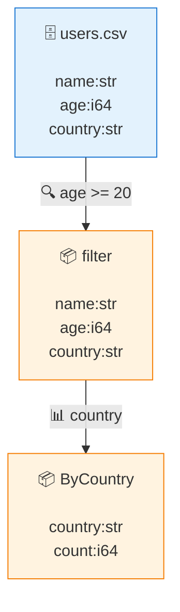

# Rivus — Syntax & Usage Guide

Rivus is a flow-oriented, DAG-native, streaming data runtime. You describe a
**flow** — sources → transforms → sinks — and Rivus executes it chunk by chunk,
in bounded memory, with the optimizer and live telemetry built in.

This guide is the practical reference: the full syntax, every operator, and a
gallery of copy-pasteable one-liners. For the design rationale see
[`docs/design/`](design/README.md); for install see the [README](../README.md).

> 🇯🇵 日本語版は [**`docs/GUIDE.ja.md`**](GUIDE.ja.md) を参照してください。

---

## 1. The 10-second mental model

```
Scope:                 # a named node in the execution graph
    open data.csv      # a source (head of the flow)
    |? age >= 20       # a transform (filter)
    |> name age        # a transform (project)
    save out.csv       # a sink
;                      # end of scope
```

- A program is a set of **scopes**. `Name: … ;` defines one.
- The first line of a scope is its **source** (`open …`); the rest are
  **transforms** and **sinks** applied left-to-right.
- `|?` `|>` `|#` are pipe operators; `->` `+` `&` build the DAG (branch / merge /
  join). Scopes can reference each other by name.
- Whitespace and newlines are insignificant — a scope can be one line or many.
  `#` starts a line comment (but `|#` is the group operator); `#{ … }#` is a
  block comment. Comments are **inert trivia** — no execution meaning — but they
  are preserved through the IR, so `rivus fmt` round-trips them (formatting never
  erases your notes).

---

## 2. Running a flow

```sh
rivus run     <program>     # execute + visualize (graph, errors, output preview)
rivus explain <program>     # show the DAG IR, optimizer report, regenerated source
rivus check   <program>     # parse only (report syntax errors)
rivus fmt     <program>     # reformat to canonical source (preserves comments)
```

`<program>` is **one of**:

| form | example |
|---|---|
| a file | `rivus run flow.riv` |
| inline string (`-c`) | `rivus run -c 'U: open users.csv \|? age >= 20 ;'` |
| stdin (`-`, heredoc) | `rivus run - <<'RIV' … RIV` |

Flags: `--chunk-size N` (rows per chunk, default 4096), `--no-opt` (disable the
optimizer), `--json` (emit machine-readable **JSONL telemetry** to stderr
instead of the ASCII view — one object per node + per error + a summary; stdout
stays clean data, so `rivus run flow.riv --json 2>telemetry.jsonl >out.csv`
splits data and metrics cleanly), `--telemetry-addr HOST:PORT` (stream that same
JSONL to a TCP socket for a live external viewer; falls back to stderr if the
connection fails).

**stdout vs stderr.** The execution graph, telemetry and error stream go to
**stderr**; a `save stdout` sink writes clean data to **stdout**. So Rivus drops
straight into a shell pipeline:

```sh
rivus run -c 'U: open users.csv |? age >= 20 |> name age save stdout as csv ;' | sort
```

### Running flows on Windows (quoting & encoding)

- An inline `-c` flow that contains double quotes — e.g. a format string like
  `datetime("yyMMddHHmmss")` — can break in `cmd`/PowerShell, which strips the
  inner `"`. The parser then sees `datetime(yyMMddHHmmss)` and reports `expected a
  quoted format string`. **Put the flow in a file and run `rivus run flow.rivus`**
  instead of `-c` (or escape the quotes for your shell).
- A leading UTF-8 **BOM on the flow script is fine** — Rivus strips it. (Data CSVs
  keep their own BOM regardless.)

---

## 3. Sources (the head of a flow)

| syntax | reads |
|---|---|
| `open PATH` | format from the extension (`.csv` → CSV, `.jsonl`/`.ndjson`/`.json` → JSON, `.parquet` → Parquet) |
| `open PATH as FMT` | force the format (`FMT` = `csv` \| `tsv` \| `json` \| `jsonl` \| `ndjson` \| `parquet`) |
| `open PATH` (`.tsv`/`.tab`) | **TSV** — tab-delimited, picked up from the extension (std-only). `as tsv` forces it on any path; `as csv` forces commas back |
| `open PATH.gz` / `PATH.zst` | **compressed** CSV/TSV — gzip (`.gz`, opt-in `--features gzip`) or zstd (`.zst`/`.zstd`, `--features zstd`). Serial single-pass, bounded memory. The default (zero-dependency) build errors with `rebuild with --features gzip`/`zstd` |
| `open PATH.parquet` | **Apache Parquet** (opt-in `--features parquet`, read-only): typed lanes come straight from the file's schema — int64→int, double→float, utf8→str, DATE→date, TIMESTAMP millis/micros→datetime, DECIMAL→decimal — with real nulls. Uncompressed/snappy/gzip codecs; row-group streaming (bounded memory); nested columns error with guidance. The default (zero-dependency) build errors with `rebuild with --features parquet` |
| `open PATH noheader` | CSV with **no header row** — every line is data, columns are named `c0, c1, c2, …` |
| `open PATH (col[:type] …)` | **declare a schema**: name columns positionally (overrides the header / `c0…`) and optionally fix a column's type — `int`/`i64`, `float`/`f64`, `str`/`string`, `bool`, `decimal(N)` (exact fixed-point), `datetime[("fmt")]` (exact timestamps), `duration` (signed time spans), `date` (ISO `yyyy-MM-dd` calendar dates), or `time` (`HH:mm:ss` time-of-day; see §6). e.g. `open f.csv (id:int zip:str age)` keeps `zip`'s leading zeros; `open sales.csv (id amount:decimal(2))` reads `amount` exactly; `open log.csv (ts:datetime("yyMMddHHmmss"))` reads `ts` as instants |
| `readcsv PATH` | CSV, explicitly |
| `readjson PATH` | JSON / JSON Lines, explicitly |
| `readbin PATH [le\|be] [packed\|aligned] (name:type …)` | fixed-width binary records (a C-struct dump) |
| `open stdin` / `open -` | read CSV (or `as FMT`) from standard input |
| `stream NAME` | replay a named flow (MVP: reference) |

Format detection deliberately **does not over-trust the extension**: use
`open data.dat as json` when the extension lies, or the `readcsv`/`readjson`
verbs when you want it obvious at a glance.

**Headerless files: names + types together.** `open data.csv noheader (id:int
name:str age:int)` gives a headerless file both column **names and types** in one
schema (the first line is read as data). A schema *without* `noheader` treats the
first line as a **header and consumes it** — so add `noheader` when the first
line is already data, or you'll lose that row. Rivus helps here: if the consumed
first line *looks like data* under your declared types, it raises a never-silent
warning telling you to add `noheader` (a real header is left alone, so renaming
an existing header stays quiet).

**Supported formats today:** CSV (with quoted-field handling), JSON Lines
(one object per line) and JSON arrays (`[ {...}, {...} ]`), and fixed-width
binary. JSON/JSONL/NDJSON all go through the same reader.

**Binary example** — decode `(i32 id, i32 age, f64 score, u8 active)` records:

```
B: readbin dump.bin (id:i32 age:i32 score:f64 active:u8) |? age >= 18 ;
```

`le`/`be` choose byte order (default little-endian); `packed` (default) vs
`aligned` choose C `repr(C)` natural-alignment padding. Field types:
`i8 i16 i32 i64 u8 u16 u32 u64 f32 f64 bool`, plus **`char[N]`** — a fixed
`N`-byte text field (a C `char[N]`) decoded as UTF-8. All `N` bytes are kept as
the value (trailing NUL / padding included; `char[N]` aligns to 1 byte), so
`name:char[16]` reads a 16-byte name field. e.g.
`readbin people.bin (id:i32 name:char[16])`.

### Provenance — `with source` / `with filename`

Attach **where each row came from**. Add `with source` (or `with filename`)
after any source — it works on every format:

```
open data.csv with source        # ride the origin handle on each chunk
open data.csv with filename       # …and materialize a `filename` column
```

- `with source` rides the origin **handle** on each chunk (zero new columns —
  reach it with the `source.uri` / `source.scheme` accessor, §6). Off by default,
  so a plain `open` adds no overhead.
- `with filename` is the sugar `(source.uri) as filename`: it appends a
  `filename` column (the source path, a `str`) at the end of the row. If the data
  already has a `filename` column, the new one is named `filename_r` (the join
  collision rule).
- Provenance is **byte-identical** across serial and parallel reads: every reader
  derives the same handle from the same path, so a parallel run reproduces the
  serial bytes exactly. Only the uri is in-contract; any size/mtime a future
  discovery attaches stays out of the determinism contract.

```
# tag each row with its file, then keep that column
open sales.csv with source |> id amount (source.uri) as src
```

### `ls` — discovery (list files as a stream)

`ls "glob"` turns a directory walk into a **flow**: it emits one row per matching
file, which you filter / project / feed onward like any other stream. Aliases:
`gci`, `dir`.

```
ls "logs/**/*.csv"            # recursive glob → a row per match
  |? size > 1000              # filter on the file's columns
  |> path name
```

- **Glob**: `*` / `?` / `[…]` match within a path segment, `**` recurses across
  segments. std-only (zero-dep); symlinks are not followed. Matches come in
  **deterministic** order (uri ascending); 0 matches → a warning + empty stream.
- **Columns** (ordinary, so normal predicates/projection work):

  | col | type | |
  |---|---|---|
  | `path` | resource | the file handle (renders as its path/uri; what `read` will consume) |
  | `name` | str | the file name (basename) |
  | `size` | int | size in bytes |
  | `mtime` | datetime | last-modified time |

- `size` / `mtime` are tagged **outside the determinism contract** (§0.14).
  Within a single run the filesystem is fixed, so results stay byte-identical
  across serial/parallel; the tag matters across *different* runs — `interpret ==
  compile` (Phase 2, where compile-time and run-time can see a changed `mtime`)
  and distributed execution. `path` and `name` are deterministic.

> **Handle fields go in a computed column.** A handle accessor like `source.uri`
> (§6) must appear inside `|> (…)`, e.g. `|> (source.uri) as p`. Writing a dotted
> field bare in a predicate (`|? source.uri == …`) is a deliberate error — it
> would be ambiguous and wouldn't round-trip. For `ls`, just use the bare columns
> (`name` / `size` / `path`).

### `read` — open many files into one stream

`read [as FMT] [with source|filename]` consumes a **`Resource` column** (the
`path` from `ls`, or any `resource(…)`-typed column — default `path`, else the
first resource column) and opens + decodes every handle, concatenating the files
into one stream **by name**:

```
ls "sales/2026/**/*.csv" |? size > 0  read as csv with source  |# country sum:amount

# a manifest of paths works the same — read is source-agnostic
open manifest.csv |> (resource(filepath)) as path  read with source
```

- **union-by-name**: the output columns are the union of all files' columns (in
  first-seen order); a file missing a column gets `null` for it. Column types
  **widen** so nothing truncates: `int ⊆ float ⊆ decimal`, and anything mixed
  becomes `str` (so an `int` column in one file and a `float` in another both read
  as `float`).
- **`as FMT`** forces a format for every file (`csv` / `tsv` / `jsonl`); without
  it each file's format follows its extension. (CSV + JSONL today; binary later.)
- **never-silent**: a handle that can't be opened or decoded is **quarantined** —
  surfaced on the error stream and skipped, while the other files keep going
  (continue-first). Files are read in deterministic uri order.
- **provenance**: `with source` rides each file's handle on its rows (so
  `(source.uri)` is the file that row came from); `with filename` also adds a
  `filename` column.

### `watch` — subscribe to file changes (unbounded)

`watch "glob"` is the **unbounded** sibling of `ls`: instead of listing files
once, it subscribes to the OS change notification (inotify / FSEvents / kqueue /
ReadDirectoryChangesW) and emits a row **every time a matching file is created
or modified** — a stream that never ends, with the same columns as `ls`
(`path` / `name` / `size` / `mtime`), so `read` consumes it unchanged.

```
watch "in/*.csv"        # a row per created/modified file, forever
  take 10               # bound it: the flow stops once take is full
  read as csv           # read each changed file as it arrives
  save out.csv
```

- **Feature-gated**: runs only in a build with `--features unbounded` (the
  source tree's default build stays zero-dependency; the subscription uses the
  vetted `notify` crate — see SUPPLY-CHAIN.md). Parsing and `rivus explain`
  always work; *running* it in a default build is refused up front with this
  exact rebuild guidance — never a silent wrong answer.
- **It never ends on its own.** Bound it with `take N`, or stop the process.
  Whole-stream operators (`|#` group, `sort`, `describe`, `join`, whole-stream
  fills) are refused up front — they would wait for an end that never comes;
  windows arrive in a later slice.
- **Outside the determinism contract** (§0.14): arrival order is environmental.
  Byte-identity still holds for everything *bounded*; an unbounded flow always
  runs on the serial streaming loop, and the optimizer leaves the whole plan
  alone (and says so — visible in `rivus explain`).
- **Lossless backpressure**: events queue in a bounded buffer
  (`RIVUS_WATCH_QUEUE`, default 1024) that blocks the producer when full —
  nothing is dropped or sampled. Several notifications for one file within one
  batch coalesce into a single row; the same file changing again later is a new
  row (each change is a new handle).
- **Capability boundary**: set `RIVUS_CAP_WATCH_PATHS` (comma-separated path
  prefixes) to confine what may be watched; a root outside it is rejected as a
  surfaced event and the run continues (continue-first). The allowlist is a
  boundary, not a secret — credentials never ride the plan, the telemetry or
  the error stream. Both env knobs are environment configuration, not data.
- Deletions/renames emit nothing (there is nothing to read).

---

## 4. Transforms

Applied left to right; each consumes the stream and produces a new one.

### `|?` — filter

Keep rows where the predicate is true.

You can use `where` as a readable alias, and **commas mean AND**:

```
|? age >= 20
where age >= 20, country == "JP"      # comma = AND (same as `and`)
|? country == "JP" and active == true
|? score > 90 or age < 18
|? (score / age) > 3          # arithmetic in parens (see §6)
```

### `|!` — validate (declare a row contract)

A **validator is not a filter.** `|?` quietly drops the rows it doesn't want;
`|!` declares a *contract* — a row that fails it is disposed of **explicitly and
always reported** on the error stream (never silent). Same predicate syntax as
`|?` (commas = AND), followed by a **required disposition**:

```
|! age >= 0, age <= 120 warn         # keep every row, but report the violations
|! email contains "@" reject         # drop the failing rows, and report them
|! id >= 1 halt                      # stop the run on the first violation (strict)
```

| disposition | the failing row | reported |
|---|---|---|
| `warn` | kept (passes through) | yes — `N row(s) failed … (warn)` |
| `reject` | dropped | yes — `… (reject); dropped` |
| `halt` | — (run halts) | yes — a **fatal** event |

- The disposition is **mandatory** — there is no implicit default, so a silent
  drop policy is impossible. Every disposition surfaces the **count, the rule,
  and a sample** of an offending row (e.g. `e.g. id=2, age=-5`).
- `warn`/`reject` report a summary **on completion** (count + rule + a sample);
  the count is chunk-size independent. On the byte-range **parallel** path each
  worker reports its own summary (the counts **sum** to the total — never-silent
  either way), while `reject`'s dropped rows stay **byte-identical** to serial. A
  single coordinator-merged count is a validation-layer follow-up (§24). `halt`
  raises a `Fatal` (the run stops, continue-first §13).
- **Several contracts at once** — a `{ … }` bundle holds one contract per entry
  (`;`-separated), each with its own disposition, checked in order. It is plain
  sugar for writing the contracts as consecutive `|!` steps (and the canonical
  spelling `rivus fmt` produces for such a run):

  ```
  |! { age >= 0 warn; age <= 120 reject; id >= 1 halt }
  ```

- _Coming next (§24):_ declarative rules (`in 0..120`, `matches "…"`, `required`,
  `in {…}`), `quarantine(sink)` (dead-letter), and inter-row / windowed checks.

### `|>` — project / compute columns

Select columns, rename them, cast them, or compute new ones. Each item is one
of:

| item | meaning |
|---|---|
| `name` | keep column `name` |
| `name :alias` | keep + rename (`:` **definition chain**) |
| `name :type` | keep + cast (`int`, `decimal(2)`, `datetime`, …) |
| `name :alias :type` | rename, then cast — definitions stack left→right |
| `(expr) as alias` | a **computed column** (arithmetic in parens) |

```
|> name age                                   # select
|> name age :years                            # rename
|> name amount :amt :decimal(2)               # rename + cast in one item
|> name (age * 12) as months (score / 100) as pct
```

The `:` chain is the canonical spelling: `rivus fmt` rewrites the older
`name as alias` / `(name:type) as alias` forms into it (same IR, same output
bytes). Definitions stack light→heavy — rename first, then cast; anything
after the type is an error. After `:`, a type word always means a cast, so to
rename a column *to* a type-word name use the parenthesized escape hatch
`(col) as int`. As everywhere (§23.6), a datetime *parse format* belongs to
the source schema declaration, not to a cast.

The `rename` / `cast` verbs (below) are **not** the same operation: they fix
up named columns **in place while keeping every other column**, whereas `|>`
keeps only what you list.

**Union views — one column, many sub-views.** A fixed-width string column can
carry named **character** sub-views. `id :string(27) :{ cls@0..3 dept@3..11 }`
keeps `id` as one physical column and defines zero-copy slices `cls` (characters
`0..3`) and `dept` (`3..11`) over it. Reference a sub-view in expression context
with the same `.` accessor as `source.uri` (§6):

```
|> id :string(27) :{ cls@0..3 dept@3..11 equip@11..27 }   # define the sub-views
|> (id.cls) as cls (id.dept) as dept                       # reference them
```

The ranges are **half-open character offsets** `[start, end)`, so multi-byte
text is never split mid-character. Sub-views may overlap and need not cover the
whole width (gaps are just padding). An offset that runs past the end of a cell
is a never-silent failure — that cell becomes null and the count is surfaced on
the error stream, never silently wrong.

### `|#` — group by

Partition by one or more key columns and aggregate. A `count` column is always
emitted; each `func:col` adds one aggregate. Functions:

- numeric: `sum avg min max std` (std is sample, ddof=1) — all **skip `null`**
- percentiles: `median` and `pNN` (`p50 p90 p99 …`, linear interpolation)
- **counts (the COUNT(\*) vs COUNT(col) distinction, design 26 §26.2d):** the
  implicit `count` is **COUNT(\*)** = the group's row count (nulls included);
  `count:col` is **COUNT(col)** = the number of **non-null** values of a column
- distinct count: `count_distinct` (alias `nunique`) — distinct **non-null**
  values (a real `""` is a value, a `null` is not)
- positional: `first last` — the first/last **non-null** value in source order
  (an all-null group yields `null`)

```
|# country                          # → country, count   (COUNT(*))
|# country region sum:score         # multi-key: → country, region, count, sum_score
|# country sum:score avg:age        # → country, count, sum_score, avg_age
|# country count:email              # → country, count, count_email   (non-null COUNT(email))
|# country median:score p90:score   # → country, count, median_score, p90_score
|# country count_distinct:city      # → country, count, count_distinct_city
```

Multiple keys partition by the column *tuple* (each key becomes its own output
column, before `count`). Output columns are named `count` and `<func>_<col>` (e.g. `sum_score`,
`p90_score`). `std`/percentiles buffer each group's values (a pipeline-breaker
like `sort`); the rest stream in O(1) memory per group.

### `take` / `limit` / `head` — cap rows

```
take 100        # keep the first 100 rows, then stop
limit 100       # alias
head 100        # alias
```

### `sort` — order by one or more keys

A stable sort over the whole stream (a blocking step). Ties keep source order.
Multiple keys sort by each in turn, each with its own direction.

```
sort age              # ascending (default)
sort age asc
sort score desc
sort team score desc  # team ascending, then score descending within a team
```

### `distinct` — drop duplicates

Keep the first occurrence. With no keys the whole row is the dedup key;
otherwise only the named columns.

```
distinct                # unique rows
distinct user_id        # first row per user_id
distinct country region # first row per (country, region)
```

### `dropna` / `fill` — missing values

```
dropna                 # drop rows blank in ANY column
dropna city region     # drop rows blank in these columns
fill city "UNKNOWN"    # replace blank cells of `city` with a constant
fill price ffill       # forward-fill: carry the last non-empty value down
fill price bfill       # backward-fill: carry the next non-empty value up
fill score mean        # fill blanks with the column mean (numeric cells)
fill score median      # fill blanks with the column median
```

A "missing" cell is **`null`** — a first-class missing value, distinct from a
real `0` and from an empty string `""` (the null model, design 26). **Before:**
a blank numeric cell collapsed to `0`, so a blank was indistinguishable from a
real zero. **After:** a blank (or unparseable) numeric/date/time cell reads as
`null`, so missing-ness is detectable on every lane — you no longer have to
declare a column `:str` to spot its blanks. A `null` renders as an empty CSV
field (and a bare `null` in JSON); a real `""` is written as a quoted `""`. So
`null`, `""` and `0` survive **read → write → read** as three distinct cells
(§26.5 symmetry; the round-trip is idempotent).
`null` is skipped by aggregations (`sum`/`avg`/`min`/`max` ignore it) and
propagates through arithmetic (`null + x → null`). Null-bearing data stays
**byte-identical across serial, parallel and any chunk size** — null positions
are positional and ride the merge path unchanged (§26.4).

> **Null semantics (design 26).** A comparison with a `null` operand is
> **false**, so a filter never keeps a null row: `|? age == 0` matches only a
> real `0` (not a blank), and `|? age >= 0` excludes the blank. `dropna` drops
> rows that are `null` in a target column (not a real `""`/`0`); `fill col V`
> replaces `null` cells on any lane (`fill age 0` works on a numeric column).
> Aggregations skip `null`; group-by / `distinct` fold all nulls into one key
> (distinct from a real `""`); `sort` orders nulls last (ascending) / first
> (descending). An explicit `is null` / `is not null` predicate to *select*
> missing rows is planned (§25 syntax v2).

`ffill`/`bfill` carry the nearest neighbour across chunk boundaries (a leading
blank has nothing to forward-fill from, a trailing blank nothing to back-fill);
`bfill` buffers the stream to finish (a pipeline-breaker like `sort`), `ffill`
is fully streaming. `mean`/`median` compute a whole-column statistic over the
non-empty numeric cells and substitute it for the blanks (also pipeline-breakers,
since the statistic needs every value); an integral result is written without a
trailing `.0`. All `fill` methods leave non-blank cells untouched.

### `describe` — one-pass column summary

Replace the stream with a per-column summary (like pandas `.describe()` / SQL
`DESCRIBE`): `column`, `type`, `count`, and — for numeric columns — `min`,
`max`, `mean`. Streaming, single pass.

```
open data.csv describe save stdout as csv
# column,type,count,min,max,mean
# id,i64,1000,1,1000,500.5
# name,str,1000,,,
```

### `rename` / `drop` / `reorder` — column shape

Stateless, streaming column operations (no `|>` needed):

```
rename age years city loc   # rename in place: age→years, city→loc
drop zip notes              # remove columns, keep the rest in order
reorder name id             # move name,id to the front; rest follow in order
```

`rename` keeps each column's position, type and values (unknown names warn);
`drop` removes the named columns (unknown names are ignored); `reorder` is a
pure permutation that floats the named columns to the front (unknown names
ignored, duplicates deduped). All three round-trip through `to_source`.

### `| name` — reuse a named flow

Define a flow once, then **apply its transforms** to another stream by name —
function-composition for pipelines (no macros, no copy-paste):

```
clean:                       # a reusable transform recipe (with a source of its own)
    open raw.csv
    |? status == "ok"
    |! id >= 1 warn
    |> id status
;
report:
    open today.csv
    | clean                  # apply clean's transforms here (filter, validate, project)
    |# status
;
```

- `| name` splices in `name`'s **transforms only** (everything after its
  source, and stopping before any sink), in order, so it behaves
  **byte-identically** to writing those steps inline — same data, same error
  stream. A reuse recipe never drags its own `save …` along. Reuse is
  mechanical, not magic.
- The flow must be **defined earlier** in the program; an undefined `| name` is
  an error (never a silent skip). Name resolution is by column name, so it is
  schema-version-independent.
- It **round-trips**: `rivus fmt` re-emits `| name` (not the expanded steps).

**Value holes (`$x`) and bindings.** A recipe can leave **values** open with a
`$x` hole and have each call fill them — `prepared-statement` style:

```
adults:
    open raw.csv
    |? age >= $min, age <= $max      # $min / $max are value holes
;
report:
    open today.csv
    | adults min=20 max=65           # fill the holes at the call site
;
```

`| name k=v …` binds each `$k` hole to the **value** `v` (int, `1.5`, `-5`,
`"str"`, `true`/`false`). The binding is structural — the value is placed into
the IR as a literal, never spliced as source text — so a call can only ever
supply a *value*, never inject flow structure (**injection-safe**). A bound hole
desugars byte-identically to writing the literal inline, and `| name k=v`
round-trips through `rivus fmt`. A hole that reaches execution **unbound**
evaluates to null and is **surfaced** on the error stream (never silent), so a
forgotten binding can't quietly drop every row.

### Composing them

Transforms chain in any order:

```
open events.csv
  |? status == "ok"
  distinct session_id
  |> user (bytes / 1024) as kib
  sort kib desc
  take 20
```

---

## 5. DAG: branch, merge, join

A "linear" pipe is just a degenerate DAG. To fan out and back in:

```
# branch.riv — tee one source into two filtered flows, then merge
Users:
    open users.csv
    -> Adults: |? age >= 20 ;     # a child scope continuing from Users
    -> Minors: |? age <  20 ;
;
Merged:
    Adults + Minors               # merge (union) of two named scopes
;
```

- `-> Child: body ;` — **branch (tee)**: every chunk is forwarded to the child.
- `A + B [+ C …]` — **merge**: union of the named streams.
- `A & B on key` — **inner join** on a key (use `on lkey:rkey` when the two
  sides name the key differently). Output = left columns + right columns (minus
  the join key; a name clashing with a left column is suffixed `_r`).
- **A `null` key matches nothing** (SQL `NULL`-join semantics, §26.2a): a row
  whose join key is `null` never joins — it drops on an inner join, and is kept
  with the other side padded `null` on an outer join. So a `null` key never
  folds rows together (matching DuckDB's output count).
- **Composite keys:** `on k1 k2 …` joins on the column *tuple* — e.g.
  `A & B on country region` matches rows agreeing on both. Each key may be
  `lk:rk` for differing names (`on a x:y`). Works for every join kind below.
- `A &left B on key` — **left outer join**: every left row is kept; when no
  right row matches, the right columns are padded with **`null`** (the
  unmatched side is genuinely missing, not a zero/empty string).
- `A &right B on key` — **right outer join**: every right row is kept (the left
  columns padded with defaults). The join-key column keeps the right key, so an
  orphan right row never loses its key.
- `A &full B on key` — **full outer join**: every row from both sides; unmatched
  rows are padded on the missing side.
- `A & B [on key…] asof ts [within "5m"]` — **as-of / temporal join** (#64):
  enrich each left row with the right row whose datetime `ts` is the **nearest at
  or before** the left's, matched exactly on the `on` keys (a `by` group, e.g.
  `on sym`); left-outer, so an unmatched left row keeps `null` right columns. The
  optional `within "DUR"` drops a match older than the bound (closed threshold).
  The right `ts` and `on` columns are dropped from the output (the left carries
  them). Both sides are assumed time-ascending; the right side is sorted per
  group so the result is chunk-size independent (serial). Datetime `≤` is exact
  (i64 ticks). Example: `Trades & Quotes on sym asof ts within "1m"`.

```
# inner join two CSVs on `id`
Users:  open users.csv ;
Orders: open orders.csv ;
Joined: Users & Orders on id  |> name amount  save out.csv ;

# left join: keep every user, even those with no order (amount → 0)
AllUsers: Users &left Orders on id  |> name amount  save out.csv ;
```

Reference scopes by the names you gave them. The CLI prints the whole graph.
Join is a blocking step (it buffers both inputs), like `sort`/`|#`.

---

## 6. Expressions

Used in `|?` predicates and `(…)` computed columns.

**Values**

| kind | examples |
|---|---|
| integer / float | `42`, `3.14` |
| string | `"JP"` (escapes: `\n \t \" \\`) |
| boolean | `true`, `false` |
| field of the current row | `age` (bare), `$_.age` (explicit) |
| positional field | `$_[0]` — the i-th column, 0-based, schema order (headerless data); out-of-range → null, counted |
| regex literal | `'^JP-\d{4}$'` — **raw** (backslashes belong to the regex); only valid as a pattern: `code ~ '…'` or `regexp(code, '…')` |
| deep / dynamic field | `$_..age` (recursive), `item("age")` (dynamic) |
| parent scope field | `$_:1.country` (`$_:0` = current, `$_:1` = parent …) |
| value hole | `$min` — a placeholder filled by a binding (`\| flow min=20`), §4 |
| resource handle | `resource("file:///data/a.csv")` — a first-class I/O handle |
| provenance field | `source.uri`, `source.scheme` — a field of the chunk's origin (needs `with source`, §3) |
| union sub-view | `id.cls` — a character slice of a fixed-width column defined by `id :string(W) :{ cls@0..3 … }` (§4 `\|>`) |

> **Resource handle** (`resource("uri")`) is a first-class value identified by its
> `uri` (`file://`, `s3://`, `http://`, `-` for stdin). It is the handle type that
> provenance (`with source`) and discovery (`ls`/`glob`) build on. Only the uri is
> the value's identity — any size/mtime metadata a discovery attaches is *not* part
> of equality, ordering, or `to_source` (so results stay reproducible). Cast any
> value to it with `expr:resource` (its text becomes the uri); `resource(EXPR)` is
> the same thing — `resource("…")` is a literal, `resource(col)` /
> `resource(concat("data/", region, ".csv"))` build a handle from a manifest
> column or a computed path (a stream of handles for a future `read` to open).

> **Provenance accessor** `source.<field>` reads a field of the chunk's origin
> handle, set by `with source` (§3): `source.uri` is the path/uri the row was read
> from, `source.scheme` its transport (`file`, `stdin`, `s3`, …). It is `null`
> when the source was opened without `with source` (continue-first). A bare
> `source` (no `.field`) is still an ordinary column reference, so a real column
> named `source` stays reachable.

**Functions**

- *string* — `upper(s)`, `lower(s)`, `trim(s)`, `len(s)` → int,
  `substr(s, start, len)` (1-based start, SQL convention),
  `replace(s, from, to)`, `split_part(s, sep, n)` (1-based field; negative
  counts from the end, `-1` = last), `concat(a, b, …)`.
- *path* — `basename(p)` (final segment: `/x/y/jp.csv` → `jp.csv`),
  `stem(p)` (basename without its extension: `jp`), `dirname(p)` (the path
  up to the final segment, POSIX style: no separator → `.`). The idiomatic
  way to shorten a `with filename` provenance column for reports (#199).
- *predicates* (→ bool) — `contains(s, sub)`, `starts_with(s, p)`,
  `ends_with(s, p)`, `like(s, pat)`, `glob(s, pat)`, and (with `--features
  regex`) the regex test: `s ~ 're'` — the **`~` infix** with a raw `'…'`
  regex literal is the canonical spelling; `regexp(s, re)` / `regex` /
  `matches` are call-form aliases (needed when the pattern is computed or
  contains a `'`). Parsing and `explain` always work; a build **without** the
  feature refuses to *run* such a flow with explicit guidance (never a silent
  all-false).
- *numeric* — `abs(x)`, `round(x)` (ties away from zero), `floor(x)`, `ceil(x)`;
  each returns an integer when the result is whole, else a float.
- *null-coalesce* — `coalesce(a, b, …)`: the first **non-null** argument
  (the SQL/pandas null-coalesce). A real empty string `""` is non-null, so it
  is kept; only `null` is skipped (design 26 §26.2).

```
|? contains(email, "@gmail")
|> (upper(name)) as NAME (len(name)) as nlen (substr(zip, 1, 3)) as area
|> (round(price * 1.1)) as gross (coalesce(nick, name)) as display
```

**Comparison** — `==  !=  <  <=  >  >=`
**Logic** — `and`, `or`
**Arithmetic** (inside parentheses) — `+  -  *  /  %`, with `* / %` binding
tighter than `+ -`; nest with parens.

```
|? country == "JP" and (score / age) >= 2.5
|> name (qty * price) as total (qty * price * 0.1) as tax
```

> Arithmetic operators are only tokenized **inside parentheses**, so paths like
> `open /tmp/a-b.csv` keep lexing as a single word outside parens. Wrap any
> computed expression in `( … )`.

**Type casts** — `expr:type` reinterprets a value's lane (`int`/`i64`,
`float`/`f64`, `str`/`string`, `bool`, `decimal(N)`, and the temporal lanes
`datetime`/`date`/`time`), binding tightest:

```
|? age:int >= 20            # compare a *string* column numerically
|> id (price:f64 * 1.1) as gross
|> (age:str) as age_text    # the add-property cast (3rd way to type a column)
|> (ts:datetime) as t       # parse a *string* into the datetime lane
cast age:int price:f64      # the `cast` verb: re-type columns in place
cast ts:datetime            # parse a string column into datetime in place
```

The **`cast COL:type [COL:type …]`** verb is sugar for re-typing named columns
in place (position and name kept), e.g. `cast age:int price:f64`. Unknown
columns warn and are skipped; it round-trips through `to_source` (type names
render canonically, `int` → `i64`).

A cast **to a temporal lane** (`datetime`/`date`/`time`) *parses* a string source
with the auto formats — the same meaning as the reader, so `cast ts:datetime`
gives byte-identical values to declaring `(ts:datetime)` at `open`; only the speed
differs (the reader's exact text path is faster). A value that won't parse becomes
`null` and the count is **surfaced** on the error stream (never-silent). A **parse
format belongs to the schema, not an expression cast**: `cast ts:datetime("fmt")`
(or `(ts:datetime("fmt"))`) is a parse error — declare the format at the source,
`open f.csv (ts:datetime("fmt"))`, and cast bare downstream. (Behavior change: a
string→`datetime`/`date`/`time` expression cast previously produced epoch-0 /
garbage; it now parses correctly.)

Numeric arithmetic stays integer when both sides are integers (except `/`,
which is always float, like SQL/pandas). Strings are parsed best-effort to a
number where arithmetic needs one; division/modulo by zero yields NaN/0 rather
than crashing (continue-first).

**Exact decimal lane (`decimal(N)`)** — an opt-in fixed-point lane (an `i128`
scaled by a fixed number of fractional digits `N`) for when float rounding is
unacceptable — money, byte-identical parallel sums. Because the value is an
integer, `0.1 + 0.2` is exactly `0.3` and addition is *associative*, so a
parallel partition-then-merge reduction reproduces a serial one bit-for-bit
(the property `f64` cannot give). Declare it at the reader for an exact text →
`i128` read (never via `f64`), or cast to it:

```
open sales.csv (id amount:decimal(2))   # read "12.5" as 12.50, exact
|? amount >= 19.99                       # compares exactly (i128, no float)
|> id amount
```

The scale is required for now (`decimal(2)`, not bare `decimal`); a cell with
more fractional digits than `N` is rounded **half-to-even** deterministically,
fewer are zero-padded, and an unparseable cell becomes `0` (continue-first).
Everything else stays on the fast `i64`/`f64` lanes by default — `decimal` is
the "trade speed for exactness" choice, never the default.

**Datetime lane (`datetime[("fmt")]`)** — read fixed-width / ISO timestamps as
**exact instants** (an `i64` count of seconds from the Unix epoch, UTC), not as
text or a lossy float. Like `decimal`, the integer form is exact and
*associative*, so datetime `min`/`max`/`count` and a date-bucketed group-by are
byte-identical in parallel. Declare a parse format, or let it auto-infer common
shapes:

```
open log.csv (ts:datetime("yyMMddHHmmss") msg)  # parse "260601143000" exactly
|? ts >= "2026-06-01"                            # literal parsed to the same lane
|> (format(trunc(ts, "day"), "yyyy-MM-dd")) as day msg
|# day count:msg                                 # rows per day (time series)
```

- **Format tokens** (a small `strptime` subset, std-only): `yyyy` `yy` `MM`
  `dd` `ddd` `HH`/`hh` `mm` `ss` `n…n`; any other character is a literal that
  must match (multi-byte literals like `年` work). Two-digit years pivot
  `00–68 → 20xx`, `69–99 → 19xx` (deterministic). A bare `:datetime` (no
  format) auto-infers `yyyy-MM-ddTHH:mm:ss`, `yyyy-MM-dd HH:mm:ss`,
  `yyyy-MM-dd`, `yyyyMMddHHmmss`, `yyMMddHHmmss`, `yyyyMMdd` in that order.
- **`ddd` weekday names** (validated): parses/renders the short weekday —
  `Mon…Sun` by default, `月…日` with a leading **`[ja-jp]` locale tag** (e.g.
  `ts:datetime("[ja-jp]yyyy年MM月dd日(ddd)")`; std-only tables, no locale
  dependency). On parse the weekday is **checked against the date** — a cell
  claiming `(月)` on a Wednesday is a counted parse failure, never silently
  accepted. An unknown locale tag is a program error at declaration.
- **`n…n` sub-second digits**: a run of k `n` reads/renders exactly k
  fractional digits, and the run's length picks the column's exact tick
  resolution (1–3 → ms, 4–6 → µs, 7–9 → ns) — every declared digit is kept as
  integer ticks (`ss.nnnnnn` reads `…00.123456` to the microsecond), and the
  default rendering of a sub-second column appends its full-width fraction so
  precision is never silently dropped. At most one run per format.
- **ISO timezone & fractional seconds** are accepted on the auto path: a trailing
  `Z` or `±HH:mm` offset is **normalised to UTC** (`…14:30:00+09:00` → `05:30:00`),
  and a fractional second is **truncated** to the column's resolution
  (`…14:30:00.5` → `…14:30:00`; the bare-`:datetime` lane is seconds — declare
  an `n…n` format to keep sub-seconds).
- **Timezone abbreviations** (std-only, fixed offsets — no DST rules, no IANA
  tzdata): a trailing ` JST`-style suffix (uppercase, one space) normalises to
  UTC when it is **unambiguous** — `UTC` `GMT` `JST` plus `MST` `HST`.
  **Ambiguous abbreviations are never guessed**: a cell carrying `CST`
  (US Central / China / Cuba), `IST`, `BST`, `PST`, `EST` (US Eastern /
  Australian Eastern), … fails its format and is counted on the error stream. Named zones (`Asia/Tokyo`) and
  DST conversion are out of scope (issue #140 — kept out so results never
  depend on an external, versioned dataset).
- **Auto-inference**: an *undeclared* column is read on the datetime lane when
  every non-empty cell is a recognised datetime (and likewise `date` for
  `yyyy-MM-dd`-only columns, `time` for `HH:mm:ss`). A purely numeric column
  stays `i64`/`f64` — a number is never mis-read as a date. Declare the type to
  override.
- **Comparisons** parse the text literal into the same lane and compare
  instants (`ts >= "260601000000"`), so the literal's shape need not match the
  column's. A cell or literal that matches no format becomes epoch `0` / a
  non-instant (continue-first; only `!=` holds against it).
- **Functions**: `year(ts)` `month(ts)` `day(ts)` `hour(ts)` `minute(ts)`
  `second(ts)` (→ integers); `trunc(ts, "day"|"hour"|"minute"|"month"|"year")`
  (→ datetime bucket key); `bucket(ts, "15m")` (→ arbitrary-width tumbling
  window key, closed-open, epoch-aligned); `date_bin(ts, "15m"[, origin])`
  (→ the same floor **aligned at an `origin` datetime** instead of the epoch —
  `floor((t − o)/d)·d + o`, closed-open, exact integer ticks; omit `origin` and
  it *is* `bucket`; the resample / gap-fill boundary primitive, #62); `hops(ts, size, hop)` (→ the *list*
  of **sliding-window** start keys containing `ts` — explode it and group:
  `|> (hops(ts, "5m", "1m")) as w price` → `explode w` → `|# w avg:price`;
  `hops(x, s, s)` degenerates to `bucket`, §36); **session windows**:
  `sessionize ts gap "30m" [by user]` appends a `session` column (the session's
  start datetime — group on it: `|# user session …`; a new session starts when
  the per-group gap exceeds the duration, out-of-order input is surfaced, §36.5);
  **shift / diff** (#65): `shift col lag|diff|pct_change [N] [by keys] as alias`
  appends a column derived from a value `N` rows back within each `by` group, in
  source order — `lag` = the earlier value (null for the first `N`), `diff` =
  `col − lag` (a `datetime` column yields an exact `Duration`, e.g.
  `shift ts diff as gap`), `pct_change` = `(col − lag)/lag` as float
  (`shift price diff by sym as delta`); chunk-size independent, serial;
  `format(ts, "fmt")` (→ text, same tokens incl.
  `ddd`/`[ja-jp]`/`n…n` — `format(ts, "[ja-jp]ddd")` renders `水`). Default
  rendering is ISO-8601 `yyyy-MM-ddTHH:mm:ss` (+ full-width fraction on a
  sub-second lane).

**Duration lane (`duration`)** — a **signed time span**, the result of
`DateTime − DateTime`. A distinct type from a datetime *instant*, because their
algebra differs: a span's `sum`/`avg` are meaningful and — being exact integer
ticks — **associative**, so `sum:dur` / `avg:dur` over a group are
byte-identical in parallel (an instant's are not). Read pre-formatted spans
with `(d:duration)` (the `[-][Nd ]HH:MM:SS[.frac]` human form), or compute them:

```
open shifts.csv (emp:str start:datetime("yyMMddHHmmss") end:datetime("yyMMddHHmmss"))
|> emp (end - start) as worked          # a duration column
|? worked >= "08:00:00"                 # compare spans (literal parsed same-lane)
|# emp sum:worked avg:worked max:worked # exact, parallel byte-identical
```

- **Type algebra**: `DateTime − DateTime → Duration`; `DateTime ± Duration →
  DateTime`; `Duration ± Duration → Duration`; `Duration × int → Duration`;
  `Duration ÷ Duration → ratio` (f64). Cross-unit operands lift to the finer
  unit; an overflow saturates (continue-first).
- **Exact, never f64**: all comparison and `sum`/`avg`/`min`/`max` run on `i64`
  ticks, so they are correct even at nanosecond resolution (ticks past 2^53,
  where `f64` would collapse adjacent values).
- **Rendering**: `format(dur)` → human `3d 02:15:00`; `format(dur, "iso")` →
  ISO-8601 `PT…H…M…S`. Default Display is the human form.

**Date lane (`date`)** — a **calendar date** with no time-of-day, stored as an
exact `i32` epoch-day (days since `1970-01-01`). Like the datetime/duration
lanes it is integer → exact and *associative*, so `min`/`max`/`count` and a
group-by on a date column are **byte-identical in parallel** (and `min`/`max`
keep the date type, rendering `yyyy-MM-dd`). Read (and render) ISO `yyyy-MM-dd`:

```
open events.csv (id:int day:date)   # parse "2024-06-03" into the date lane
|# day count                         # group by date — exact, parallel byte-identical
```

- **ISO `yyyy-MM-dd` only**, and it renders back as `yyyy-MM-dd` (round-trips
  through `save`, JSON emits a quoted `"2024-06-03"`).
- **Never-silent on a bad date**: an impossible date like `2024-02-30` (or any
  malformed cell) reads as **`null`** (continue-first, renders empty) **and**
  the loss is reported on the error stream — `N value(s) in column 'day' (as
  date) could not be parsed; set to null`. An **empty** cell is also `null`, but
  is "missing" not a failure (never counted), so clean data stays quiet.
- **Exact, never f64**: comparison ordering and `min`/`max`/`count` run on the
  integer epoch-day.

**Time-of-day lane (`time`)** — a wall-clock **time of day** with no calendar
date, stored as exact `i64` ticks since midnight (MVP second resolution). Reads
and renders `HH:mm:ss`; like the date lane, `min`/`max`/`count` and group-by are
exact and **byte-identical in parallel** (min/max keep the time type):

```
open log.csv (start:time end:time)   # parse "09:05:00" into the time lane
|# start min:start max:start          # exact, parallel byte-identical (HH:mm:ss)
```

- **`HH:mm:ss` only** (hour `0..23`, minute/second `0..59`); a bad time like
  `25:00:00` reads as **`null`** (continue-first, renders empty) **and** surfaced
  on the error stream (`N value(s) in column '…' (as time) could not be parsed;
  set to null`); an empty cell is also `null`, but "missing" not counted. Non-zero-padded input (`9:5:0`) parses and
  canonicalizes to `HH:mm:ss`. Sub-second input is truncated to second
  resolution (`12:30:00.5` → `12:30:00`; `:time` is a second-resolution type).

**Date / time extractors** — usable anywhere an expression is (computed
columns, filters). Each accepts a `date`, a `datetime`, or parseable text:

```
open events.csv (ts:datetime)
|> (date(ts)) as day              # DateTime → date (drops the time-of-day)
   (time(ts)) as tod             # DateTime → time-of-day (drops the date)
   (weekday(ts)) as wd            # 0=Mon … 6=Sun  (i64)
   (is_weekend(ts)) as we         # Sat/Sun → true (bool)
|? is_weekend(day)                # …and they compose / filter
```

- `date(x)` → the **date** lane (`yyyy-MM-dd`); `time(x)` → the **time** lane
  (`HH:mm:ss`); `weekday(x)` → `i64` `0=Mon … 6=Sun`; `is_weekend(x)` → `bool`
  (weekday ≥ 5). A value that won't coerce yields null (continue-first).
- _Coming next (#58):_ a dedicated `Weekday` subtype (renders `Mon`…`Sun`).

---

## 7. Sinks (the tail of a flow)

| syntax | writes |
|---|---|
| `save PATH` | format from the extension (mirrors the sources; `.tsv`/`.tab` → tab-delimited; `.json` → JSON array; `.jsonl`/`.ndjson` → NDJSON) |
| `save PATH as FMT` | force the format (`csv` \| `tsv` \| `json` \| `jsonl` \| `ndjson`) |
| `writecsv PATH` / `writejson PATH` | explicit verbs (`writejson` = NDJSON) |
| `save stdout` / `save -` | write to standard output |
| `print` | capture for the on-screen preview |

```
… save out.csv
… save out.json              # a single JSON array: [{…},{…}]
… save out.jsonl             # NDJSON: one object per line
… save - as json             # JSON array to stdout (pipe-friendly)
… save out.tsv               # tab-delimited
```

A flow can read and write the same format ("write what you can read"): CSV/TSV,
JSON array and JSON Lines are all symmetric. **`as json` is a single bracketed
array**; **`as jsonl`/`.jsonl`** is one object per line (and what `writejson`
emits). Both stream in bounded memory; an empty result is `[]` (json) or no
lines (jsonl).

### Partitioned / dynamic output (route)

A quoted `save` path may **route rows to many files** by their key values
(design §28.7, ratified #143):

```
… save "out/{country}.csv"            # template: {col} derives the keys
… save "out/" by country region       # Hive layout: out/country=JP/region=13/part.csv
… save "out/" by country as flat      # flat names: out/JP.csv
… save "out/" as jsonl by country     # any sink format partitions
```

- **Template placeholders are the partition keys** — `save "out/{country}.csv"`
  ≡ `by country`. A `by` key that does not appear in the template is a
  declaration-time error (a key never silently adds a directory level).
  Literal braces are written `{{` / `}}`. A placeholder may also be an
  **expression** (`save "out/{substr(id,22,4)}.csv"`) — each one is its own
  computed, anonymous key (an eval failure routes the row to the null
  partition, counted).
- **Deterministic & byte-identical**: the file set and every path are a pure,
  injective function of the key values (path-unsafe characters incl. `%` are
  percent-escaped); rows keep stream order within each partition, so each file
  is byte-identical across serial / parallel / chunk-size. A null key goes to
  the DuckDB-compatible `__HIVE_DEFAULT_PARTITION__` partition.
- **Written out in full** (#143): a partitioned save is an explicit opt-in —
  there is no preventive cardinality cap and never a silent fallback to a
  single file; an unwritable partition surfaces on the error stream while the
  other partitions continue. The partitioned writer is **bounded-memory** — it
  streams rows to files as they arrive through an LRU pool of open handles
  (`RIVUS_ROUTE_FD_BUDGET`, default 512), not by buffering the whole result.

---

## 8. Lifecycle hooks (continue-first)

Rivus never crashes on bad input — malformed rows become events on a side
**error stream**, and the flow keeps running. You can react to that stream:

```
Import:
    open messy.csv
    |? age >= 20
    on error severity >= warning:
        transition degraded        # escalate the runtime mode
    ;
;
```

Hook form: `on EVENT [severity >= SEV] : ACTION ;` where `ACTION` is
`transition <mode>` | `log "message"` | `route <Label>`. Modes:
`normal degraded recovery isolation emergency`. Only `Fatal`-severity errors
halt the flow; everything else flows on.

---

## 9. One-liner cookbook

Rivus is built to be used like `awk`/`jq` — inline, in a pipe, or as a heredoc.

**Inline (`-c`)** — visualization to stderr, data to stdout:

```sh
# filter + project a CSV to stdout
rivus run -c 'U: open users.csv |? age >= 20 |> name age save stdout as csv ;'

# CSV → JSONL conversion (one object per line)
rivus run -c 'U: open users.csv save stdout as jsonl ;' > users.jsonl

# CSV → JSON array (a single [{…},{…}], pipe straight into jq)
rivus run -c 'U: open users.csv |? age >= 20 save - as json ;' | jq '.[].name'

# top-5 by a computed column
rivus run -c 'S: open sales.csv |> product (qty * price) as total sort total desc take 5 save stdout as csv ;'

# group + aggregate
rivus run -c 'G: open sales.csv |# region sum:amount avg:amount save stdout as csv ;'

# dedup then count distinct via group
rivus run -c 'U: open log.csv distinct user_id |# day save stdout as csv ;'
```

**Unix-filter shorthand.** A *transform-only* program (one that starts with a
pipe `|…` or a transform verb) is automatically wrapped to read CSV from stdin
and write CSV to stdout — so Rivus drops in like `awk`/`jq`, no scope needed:

```sh
cat data.csv | rivus '|? age >= 20 |> name age'   # filter + project
cat data.csv | rivus 'sort age desc'              # sort
cat data.csv | rivus 'describe'                    # summary
cat data.csv | rivus '|# country sum:amount'       # group + aggregate
```

(For non-CSV stdin or other sinks, write the full `open stdin as … / save …` form.)

**Pipe into other tools** (stdout stays clean):

```sh
rivus run -c 'U: open users.csv |? age >= 20 |> name age save stdout as jsonl ;' | jq .
cat users.csv | rivus run -c 'U: open stdin |? age >= 20 save stdout as csv ;'
```

**Heredoc** for a multi-line flow without a file:

```sh
rivus run - <<'RIV'
Report:
    open events.csv
    |? status == "ok"
    |> user (bytes / 1048576) as mib
    sort mib desc
    take 10
    save stdout as csv
;
RIV
```

**Peek at a huge file instantly** — a sink-less run is a *preview*: Rivus
samples the schema and shows the first rows in flat memory, even for a 15 GB
file (add a `save` to process every row):

```sh
rivus run -c 'B: open big.csv ;'        # instant head, ~10 MiB RAM
```

---

## 9b. Worked examples (the harder stuff)

Real pipelines that exercise the DAG, joins, grouping and cleaning together.
Each is a complete program — save it to a `.riv` file or pass it with `-c`.

**Enrich orders with customers, then revenue per (country, tier).** A composite
join feeding a multi-key group with several aggregates and a percentile:

```
Customers: open customers.csv ;        # id, country, tier
Orders:    open orders.csv ;           # cust_id, amount, status

Revenue:
    Orders &left Customers on cust_id:id   # keep every order; fill missing cust
    |? status == "paid"
    |> country tier (amount:f64) as amount
    |# country tier sum:amount avg:amount p90:amount count_distinct:cust_id
    sort sum_amount desc
    save revenue.csv
;
```

**Clean a messy export, then bucket and summarize.** Declared types, imputation,
a `case` bucket and a group — the kind of thing you'd reach to pandas for:

```
Clean:
    open raw.csv (id age:str score:str region:str)
    cast age:int score:f64                 # re-type the string columns
    fill region ffill                      # carry the last region over blanks
    fill score mean                        # impute missing scores with the mean
    |> id age region score
       (case when age >= 65 then "senior"
             when age >= 18 then "adult"
             else "minor" end) as band
    |# region band avg:score median:score std:score
    save out.json                          # a single JSON array
;
```

**Sessionize a log and rank within each user.** Branch a source, compute on each
side, and emit JSON for a dashboard — with live telemetry to a socket:

```
Events:
    open events.csv.gz                     # gzip input (needs --features gzip)
    |? status == "ok"
    |> user ts (bytes / 1048576.0) as mib
    sort user mib desc                      # user asc, mib desc within user
    |> user (round(mib)) as mib (concat(user, "@", ts)) as event_id
    save - as json
;
```
```sh
rivus run sessions.riv --telemetry-addr 127.0.0.1:9000   # stream metrics live
```

**Find IDs that match a pattern and normalize them.** the `~` regex test
(feature-gated), `replace`, `split_part`, `coalesce`:

```
Ids:
    open access.csv
    |? path ~ '^/api/v[0-9]+/'              # only versioned API routes
    |> (split_part(path, "/", 3)) as version
       (replace(path, "//", "/")) as norm_path
       (coalesce(user, "anon")) as who
    |# version who
    save stdout as csv
;
```

---

## 10. Performance notes

- **Streaming, bounded memory.** CSV sources and sinks stream; a 1.1 GB / 48 M-row
  file through `open |? age>=50 |> name age save out.csv` runs in **~10 MiB** of
  RAM (it does not load the file) at **~1.45× faster than DuckDB and ~40× less
  memory** (3.0 s vs 4.4 s / 407 MiB), ~3.8× faster than awk, ~10× faster than
  Python — see [`docs/BENCHMARKS.md`](BENCHMARKS.md).
- **Parallel by default.** A single CSV **or JSONL** file ≥ **8 MiB** with a `save`
  sink (incl. `save -`) is streamed across CPU cores automatically (newline-aligned
  byte-range workers → ordered output), still in bounded memory. JSONL streams in
  bounded memory now (no whole-file slurp) and its **group-by** parallelizes too. On a 171 MiB
  filter that's ~1.6 s serial → **~0.4 s** parallel. Tune with
  `RIVUS_PARALLEL_MIN_BYTES` (bytes; `0` = always) or force serial with
  `RIVUS_NO_PARALLEL=1`. Compressed (`.gz`/`.zst`) sources can't be seeked, so
  they read serially.
- **`--memory low|auto|fast|unbounded`.** The memory/speed knob. `low` forces
  serial (lowest resource use); `auto` (default) autotunes serial-vs-parallel
  from CPU count + input size; `fast` parallelizes more aggressively (lower size
  threshold) — **all three stay in bounded memory**. `unbounded` opts *into*
  trading the bounded guarantee for speed: it parallelizes even a non-splittable
  source (compressed / JSONL / binary) by materializing the input (peak memory
  O(input)). Results are **byte-identical** across all four — only memory/speed
  differ. **Group-by** parallelizes too: byte-identical aggregates (`min`/`max`/
  `count`/`count_distinct`/`first`/`last`/percentile and exact-`decimal` `sum`/
  `avg`) run in bounded memory under `auto`/`fast`; `unbounded` extends that to
  non-splittable sources.
- **Live progress.** An interactive `rivus run` prints a `… N rows  T s  R
  rows/s` line on stderr while a long job streams.
- **Machine-readable telemetry.** `rivus run … --json` emits per-node JSONL
  (rows in/out, busy_ms, rows/s, selectivity, mode) + errors + a summary to
  stderr (stdout stays clean data); `--telemetry-addr HOST:PORT` streams it to a
  TCP socket for a live viewer.
- **Live dashboard.** `rivus run … --tui` repaints an ANSI dashboard on stderr
  (per-node bars, rows/s, state) as the run streams. `rivus run … --serve [ADDR]`
  launches a tiny std-only HTTP server (default an ephemeral loopback port):
  open the printed URL for a live browser dashboard (`GET /`), poll `GET
  /snapshot`, or subscribe to `GET /events` (Server-Sent Events). Heavy drawing
  is in the browser; Rust ships only JSON snapshots — no extra dependencies.
  **Reading it:** the graph flows **top→down** (matching the script order; a
  linear pipeline is one readable column, branches step out sideways). Each node
  shows its **IR source line** — the sort key, filter predicate, cast type — so
  you see *what* it does at a glance (full text on hover), and the **flow source**
  panel shows the whole reversible script. A **blocking** operator (`sort`,
  `group`, `join`, …) that is still accumulating shows an amber **`⏳ N`**
  "buffering N rows" state rather than a stalled-looking `0`, so a sort buffering
  before it emits reads as *working*, not stuck.
  A live view (`--tui`/`--serve`) honours `--memory` but always runs **serial**
  so the stream stays coherent (one ordered chunk sequence, not interleaved
  workers); when the autotuner would otherwise have gone parallel the surfaced
  strategy says so — e.g. `… → parallel; live observation → serial`. For the
  fastest headless run, drop the live flag and let `--memory auto` parallelise.
  A parallel run's per-worker breakdown (`rows_out`/`busy_ms`) is exposed in the
  `--json` summary as `worker_breakdown` so parallel skew is visible.
- **The optimizer runs by default** (dedup sources, fuse filter+project,
  projection pushdown, filter pushdown into the reader). `rivus explain` shows
  exactly what it did and regenerates the source from the optimized IR.
  `--no-opt` turns it off; correctness is gated byte-for-byte by the
  `optimizer_equiv` tests.

---

## 11. Full CLI reference

```
rivus run     <program> [--chunk-size N] [--no-opt] [--json]  run a flow
rivus explain <program> [--no-opt] [--write|-w]       show DAG IR; --write embeds a Mermaid DAG into a .riv.md
rivus check   <program>                               parse only
rivus fmt     <program> [--write|-w]                  reformat to canonical source
rivus gen     <shape>   [--rows N --seed S --ratio R] write seeded data to stdout

PROGRAM:
  <file.riv>                 read a bare flow (the REPL form) from a file
  <file.riv.md>              read a Literate document (frontmatter + prose + ```flow fences; §13)
  -c, --command <STRING>     pass the program inline as a string
  - | stdin                  read the program from stdin (heredoc)

GEN SHAPES (deterministic, seeded — for benches/demos, no awk needed):
  clean         well-formed id,name,age,score,country,active CSV
  error-heavy   ~ratio malformed rows (default 0.1) — continue-first stress
  mixed         ~ratio type-mixed cells (default 0.1)
  jsonl         one flat JSON object per line
```

```
# self-hosted bench: generate, then filter — no external tools
rivus gen clean --rows 1000000 | rivus '|? age >= 50 |> name age'
```

**`rivus fmt`** parses the program and re-prints it in canonical form *from the
IR* (the same renderer `explain` uses), so spacing and field forms are
normalized and the result is **idempotent**. Comments (`#…` and `#{ … }#`) are
**preserved** — they ride the IR as inert trivia. `--write`/`-w` rewrites the
file in place (needs a file path, not `-c`/stdin); otherwise the canonical
source goes to stdout. Linear flows, merge/join scopes **and `->` branch
fan-out** (tee, single, and nested) all round-trip faithfully. fmt is **honest
about round-trip**: it re-parses its own output and, if a program still uses a
construct it cannot yet render losslessly (e.g. an anonymous, unlabeled scope),
refuses with a non-zero exit and leaves the source untouched rather than rewrite
it into something different.

---

## 12. Quick grammar reference

```
program    = scope* ;
scope      = IDENT ':' body ';'  |  ':' body ';' IDENT? ;     (named / anonymous)
body       = source transform* ;

source     = 'open' PATH ('as' FMT)? 'noheader'? ('(' (IDENT (':' TYPE)?)+ ')')?
           | 'readcsv' PATH | 'readjson' PATH
           | 'readbin' PATH ('le'|'be')? ('packed'|'aligned')? '(' (IDENT ':' BINTYPE)+ ')'
           | 'stream' IDENT
           | IDENT (('+' IDENT)+ | ('&'('left'|'right'|'full')? IDENT 'on' KEY+))? ;  (merge / join)

transform  = ('|?' | 'where') expr (',' expr)*                                        (filter)
           | '|!' (contract | '{' (contract ';'?)+ '}')        (validate: row contract(s))
           | '|' IDENT (IDENT '=' VALUE)*                      (apply a named flow; bind value holes)
           | '|>' proj+                                       (project / compute)
           | '|#' IDENT+ ((AGG) ':' IDENT)*                    (group, 1+ keys)
           | ('take'|'limit'|'head') INT
           | 'sort' (IDENT ('asc'|'desc')?)+
           | 'distinct' IDENT*
           | 'describe'
           | 'dropna' IDENT* | 'fill' IDENT (VALUE | 'ffill' | 'bfill' | 'mean' | 'median')
           | 'rename' (IDENT IDENT)+ | 'drop' IDENT+ | 'reorder' IDENT+
           | 'cast' (IDENT ':' TYPE)+
           | '->' IDENT ':' body ';'                          (branch)
           | ('save' (PATH | TEMPLATE) ('as' FMT)? ('by' IDENT+)? ('as' 'flat')?
              | 'writecsv' PATH | 'writejson' PATH | 'print')   (TEMPLATE = "…{col}…", {{ }} escape)
           | 'on' EVENT ('severity' '>=' SEV)? ':' action ';' (hook)

proj       = IDENT ('as' IDENT)? | '(' expr ')' 'as' IDENT ;
contract   = expr (',' expr)* ('warn'|'reject'|'halt') ;       (disposition is mandatory)
expr       = or ; or = and ('or' and)* ; and = cmp ('and' cmp)* ;
cmp        = add (CMP add | '~' (REGEX | add))? ;               (REGEX = raw '…' literal)
add        = mul (('+'|'-') mul)* ; mul = primary (('*'|'/'|'%') primary)* ;
primary    = INT | FLOAT | STRING | 'true' | 'false' | '(' expr ')'
           | IDENT | '$_' field-tail | '$_[' INT ']' | '$_:'N field-tail | '$' IDENT
           | 'item' '(' STRING ')'
           | FUNC '(' expr (',' expr)* ')'
           | 'case' ('when' expr 'then' expr)+ ('else' expr)? 'end' ;   ('$' IDENT = value hole)
FMT        = 'csv' | 'tsv' | 'json' | 'jsonl' | 'ndjson' ;
TYPE       = 'int'|'i64' | 'float'|'f64' | 'str'|'string'|'text' | 'bool' | 'decimal' '(' INT ')' ;
AGG        = 'sum' | 'avg' | 'min' | 'max' | 'std'
           | 'count' | 'count_distinct' | 'nunique' | 'first' | 'last'
           | 'median' | 'p' DIGITS ;   (percentile, 0..=100)
CMP        = '==' | '!=' | '<' | '<=' | '>' | '>=' ;
```

That is the whole language as implemented today. Start from a one-liner in §9
and grow it.

---

## 13. Literate authoring — `.riv.md` (§31)

A `.riv` file is a bare flow — the immediate-run, REPL form. For something you
want to **keep** (configured, documented, checked into git), Rivus has a
*Literate* form, **`.riv.md`**, that layers three roles which never mix:

```markdown
---
title: adults by country
chunk_size: 4096                 # (R) resource hint — result-invariant
needs: [read:examples/users.csv] # (C) capability *declaration* (granted externally)
---

# Adults by country

This prose is an **enhanced comment**: it carries no meaning and is preserved
verbatim across `rivus fmt`. Only the fence below runs.

```flow
#| name: by-country
ByCountry:
    open examples/users.csv
    |? age >= 20
    |# country
;
```
```

- **YAML frontmatter** (`---` … `---`, at the top) — declarations only: (R)
  resource hints (`chunk_size`, …), a (C) `needs:` capability *declaration*
  (granting is the operator's job, never the script's), and meta (`title`).
  **Semantic settings stay in the flow** (`:decimal`, `:datetime`, `|!`) — they
  change the result bytes, so they are never hidden in frontmatter.
- **Markdown prose** — inert. Headings, paragraphs, and non-`flow` fences (e.g.
  ` ```mermaid `) are an enhanced comment that round-trips through `fmt`.
- **` ```flow ` fences** — the only thing that executes. A document is one
  program: every `flow` fence is concatenated in order. An untagged ` ``` ` or
  other-language fence is **display only** (never run). A per-cell `#|` option
  line (Quarto-style) at the head of a fence carries cell options (e.g.
  `#| name:`).

Every subcommand accepts a `.riv.md` path:

```sh
rivus run     examples/literate.riv.md          # run the concatenated flow
rivus check   examples/literate.riv.md          # parse only
rivus fmt     examples/literate.riv.md --write   # canonicalize flow bodies; prose kept verbatim
rivus explain examples/literate.riv.md --write   # embed a Mermaid DAG (see below)
```

**Config cascade** (`frontmatter ← CLI`): a `--chunk-size` on the command line
overrides the frontmatter hint; otherwise the frontmatter value is the default.
Because `chunk_size` is a resource hint, it never changes the output bytes
(serial byte-identity across chunk sizes) — only memory/throughput.

**`fmt` on a `.riv.md`** reformats only the `flow` cell bodies (via the IR, like
plain `fmt`) and round-trips the frontmatter, prose and `#|` options verbatim.
A cell that can't be round-tripped faithfully leaves `fmt` refusing, never a
silent rewrite.

**`explain --write`** embeds a generated, **output-only** Mermaid DAG into a
sentinel-fenced region of the document:

```markdown
<!-- rivus:begin generated by `rivus explain --write`; edits inside are overwritten -->

```text
ByCountry:
    open examples/users.csv (name:str age:i64 country:str)
    |? $_.age >= 20
    |# country
;
```
<!-- rivus:end -->
```

The region holds a **dataset-centric lineage** Mermaid DAG and the canonical,
optimized flow as an inert ` ```text ` block. In the DAG the **boxes are
datasets** — sources (🗄️), named scopes / intermediates (📦) and sinks (📄) —
each showing its columns and types (from the static schema-propagation pass,
§32.1); the **edges are the operations** (🔍 filter, 🔗 join, 📋 project,
📊 group, 🔀 sort, 🏆 take). A reshape that changes the schema (group / join /
project) is its own step (own edge + result box); only schema-invariant row ops
(filter / sort / take / distinct) fold together onto one edge. Columns
appear when the source schema is declared (`open f.csv (a:int …)`); an
undeclared source shows the box without columns (the schema isn't known
statically). It is regenerated from the IR each time (never parsed back), so
editing inside it is overwritten and re-running is idempotent — hand-written
prose around it is preserved. Both fences are inert (the flow is `text`, not an
executable `flow`), so the region never affects what `run` executes.

See `examples/literate.riv.md` for a complete document.
