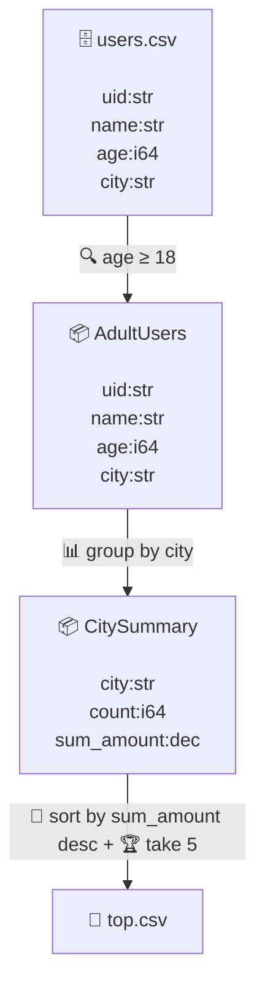

# 32. 構造化データ ＋ 静的スキーマ伝播 — データセット中心の系譜

> **本書は設計先行（doc-first・phase-0）。批准前に実装に入らない（§25.10）。
> 自己マージ禁止。** 本書は §31（構文大改革 v2）の **段階2** を詰める。#161 の批准
> （②③④＝**方向のみ確定・詳細は §32**）と、explain 可視化の **§32 申し送り**
> （#161 issuecomment-4709512127）を忠実に具体化する。未確定の決定分岐（§32.8）は
> **批准 issue（#143/#149 形式）**で裁可を得てから実装する。
>
> 既存の正しさ機械（byte-identity・continue-first・never-silent・IR 可逆・zero-dep・
> null モデル）は **保存して載せ替える**。段階1（#162/#163・`.riv.md` Literate）は不変。

関連：§03（Chunk/Column・Arrow 後継）・§06（execution-aware typing・widening ラティス）・
§21（decimal レーン）・§23（datetime レーン）・§26（null モデル）・§28（`source.uri`/
provenance）・§29（記号原則・`base.name` 共用体ビュー）・§31（傘 doc・段階分割）・
**#161（②③④ 批准・§32 申し送り）**・#160（§31 doc）。

---

## 32.0 狙いと位置づけ — 「データ構造が見える」

§31 段階1 は authoring 形式（`.riv.md`）を一級にした。**段階2（本書）は、データの構造を
一級にする**——2つの相補的な仕事：

1. **構造化データ**：JSON/Parquet のネスト（オブジェクト・配列）を、現状の degrade-to-string
   （`crates/rivus-runtime/src/jsonl.rs:28` `JVal::Raw(String)`・ネストは Str レーンへ退避）から
   **typed nested（Arrow 流 Struct/List）**へ引き上げる。
2. **静的スキーマ伝播**：各ノードの**出力スキーマ（列名＋型）を IR レベルで静的算出**する。
   現状これは **存在しない**——IR は schema-blind で、出力スキーマは runtime が実データを観測して
   初めて決まる（§32.1）。

この2つは独立に見えて**同じ土台に乗る**。構造化のパスアクセス（`user.age`）の解決もネスト型の
検査も、そして explain の**データセット中心ビュー**（ノード＝型付きデータセット）も、すべて
「各点でスキーマが分かる」ことを前提にする。だから **静的スキーマ伝播が本書の背骨**。

**北極星（#161 §32 申し送り）**：explain を **データセット系譜**にする——ノード＝名前付きの
型付きデータセット（**全列・省略なし**・絵文字 🗄️源/📦中間/📄沈）、辺＝操作（🔍 filter /
🔗 join / 📋 project / 📊 group / 🔀 sort / 🏆 take）。「データの構造がどう変わるか」が見える
＝ §06「Execution-aware typing」＋ 原則1「Everything is Flow」の可視化。段階1 の暫定 op-graph
（1 IR-op = 1 ノード・#162/#163）を**置換**する。

**段階1 との切り分け**：段階1 の explain ＝可読トポロジまで（静的推論が無いのでスキーマは流さない）。
**本書 §32 ＝ ①静的スキーマ伝播 ＋ ②構造化（Struct/List）＋ ③データセット中心 explain ＋
④ネスト型表示**。

**本書の対象外**：`Map`（動的キー）型は後段の別スライス（#161 ②）／設定スクリプト化＝§33（段階3）／
非有界 window/watch（§30/#157 で確定済み）／Arrow バックエンドへの物理移行（§03・本書は論理型のみ）。

---

## 32.1 静的スキーマ伝播パス — 本書の土台

### 現状：IR は schema-blind

確認済み（grounding）：**IR（`rivus_ir::PlanGraph`/`Op`）は出力スキーマを持たない**。`graph.rs`
に `output_schema` 系のメソッドは無い。`Op` が抱えるのは**入力列名**（`GroupBy{keys:Vec<String>}`
等）だけで、型情報は乗っていない。出力スキーマは **runtime が実データを観測して**初めて確定する：

- `ProjectExpr`（`operators/transform.rs:1264`）：出力型＝**評価した式のレーン**（`col.dtype()`）。
- `GroupBy`（`operators/aggregate.rs:649-829`）：キー列は `Str`、集約列は**観測依存**——
  decimal で収まれば `Decimal{scale}`、溢れれば `F64` フォールバック（`aggregate.rs:789-810`）。
- `Join`（`operators/join.rs:201-236`）：出力＝左 fields ＋ 右 fields（join キー除く・衝突は `_r`
  サフィックス）＝**入力スキーマから決定的**。
- `Project`（`transform.rs:1287`）：`Chunk::project()` で入力スキーマから決定的。

optimizer は全スキーマを作らず、式を**構造的に走査**して列名を集める（`optimizer/lib.rs:471`
`collect_fields`）。projection pushdown も「下流 `FilterProject` が射影を明示するなら」という
保守条件で動く（`lib.rs:390`）。

### 設計：IR レベルの出力スキーマ算出

各 `Op` に**スキーマ transfer 関数** `out_schema(in_schemas: &[&Schema]) -> Schema` を定義し、
源（`open` の宣言型／reader 推論）を起点に **topo 順で各ノードの出力スキーマを静的算出**する。
`Schema`（`crates/rivus-core/src/schema.rs:25`＝`Vec<Field>`・`Field{name, DataType}`・`index_of`）
を IR でも使う。具体（既存 runtime の鏡像）：

| Op | 出力スキーマ transfer |
|---|---|
| `Source`/`Read` | 宣言スキーマ（CSV `declared`）／reader 推論スキーマ（typed nested 含む・§32.2） |
| `Filter`/`Validate`/`Take`/`Sort`/`Distinct`/`DropNa`/`Fill` | **入力スキーマを保存**（行を変えるだけ） |
| `Project`/`Drop`/`Reorder`/`Rename` | 入力スキーマの**列の選択・改名・並べ替え**（決定的） |
| `ProjectExpr` | 各 `(expr, alias)` の **式型を静的評価**（`Expr` → `DataType`・§32.1 式型付け） |
| `Cast` | 名指し列の型を cast 先へ |
| `GroupBy` | キー列（型は入力から）＋ `count:i64` ＋ 各集約の**宣言型** |
| `Join` | 左 ＋ 右（キー除く・衝突 `_r`）＝ runtime と同規則 |
| `FilterProject` | `fields` があればその射影、無ければ入力保存 |
| `Branch`/`Merge` | 入力スキーマを伝播（Merge は union-by-name） |

**式の静的型付け**（`ProjectExpr`/`Filter` が要る）：`Expr` → `DataType` の純関数。`Field{name}` は
スキーマ参照、`Literal(v)` は `v` の型、`Arith` は widening ラティス（§06・`int⊆float⊆decimal`）、
`Compare`/論理は `Bool`、`Cast{ty}` は `ty`、`Func` は関数の戻り型表。**パス式**（§32.3）は
ネスト型をたどる。

### 静的型 vs runtime 観測 ＝ 宣言的・保守的

要注意の論点：**GroupBy の集約型は runtime 観測依存**（decimal か f64 フォールバックか）で、
静的には一意に決まらない。静的スキーマは **「宣言的・名目型」**＝「設計上はこのレーン」を表す
（exact 経路なら decimal、既定 f64 経路なら f64）で、runtime の特化観測（§06.5・hot path）とは
**別レイヤ**。explain や型検査には名目型で十分。**byte-identity には一切触れない**（静的スキーマは
**実行を変えない**・あくまで IR の射影）。曖昧な所は保守的に widen（例：sum は exact 注釈が無ければ
既定レーンの名目型）。

**配置**：`rivus-ir` に `PlanGraph::schemas() -> Vec<Schema>`（ノード id → 出力スキーマ）を新設、
または optimizer のアナリシスとして。**IR/optimizer の挙動はゼロ改造**（伝播は読み取り専用・
最適化判断には使うが結果バイトは不変）。これは §06 の3層型付け（structural/lane/observed）の
**structural 層を IR に持ち上げる**ことに相当する。パス式キー解決・ネスト型検査・データセット
explain の**共通土台**。

---

## 32.2 構造化データモデル — Arrow nested Struct / List

**構造化 ≠ 行指向ボックス**。現状 core はフラット・スカラ列のみ（`crates/rivus-core/src/chunk.rs:299`
`ColumnData` の Bool/I64/F64/Dec/DateTime/Duration/Date/Time/Str/Resource＝10レーン・**Struct/List
無し**）。`DataType`（`value.rs:1399`）・`Value`（`value.rs:1319`）も同様。ネストは degrade-to-string。

v2 は **Arrow レイアウトのネスト列**を足す（依然 columnar・SIMD フレンドリ・byte-identical）：

- **Struct ＝ 子列の束**：`Struct(Vec<(String, Column)>)` 的——field 名 → 子 `Column`。各子は
  自分の validity を持つ（§26 null モデルが再帰）。
- **List ＝ offsets ＋ 子列**：`List{offsets: Vec<i32>, child: Box<Column>}`——可変長。`offsets[i]..
  offsets[i+1]` が i 行目の要素範囲。Arrow の標準レイアウト。

`DataType` に `Struct(Vec<Field>)` / `List(Box<DataType>)`、`Value` に `Struct(Vec<(String,Value)>)`
/ `List(Vec<Value>)` を追加。`chunk.rs:6` が予告する **§03「Arrow-backed, zero-copy successor that
slots in behind this same API」**と同線（§03.5 Arrow 移行計画）。

**退化形（フラット・スカラ列）は無改造の最速路**：ネストはそれを子に持つ**再帰構造**で、深さ0
（スカラ）が既存レーンそのもの。**退化形の経路・バイト・テストを1ビットも変えない**のが安全の核
（§32.6 で pin）。

**never-silent なネスト破損**（#158 の構造化の肝）：reader は **degrade-to-string をやめる**。
`jsonl.rs` の `JVal::Raw`（`{`/`[` を生 JSON テキストに退避・`jsonl.rs:689-690`）を **typed nested
へ parse** する。壊れたネスト（型不一致・欠損フィールド）は **不透明文字列退避ではなく型付き null
＋計上**（§26）。混在（ある行は object・ある行は scalar）は union 型ではなく、保守的に**最も広い
名目型へ widen ＋ 不一致セルを null＋計上**（never-silent）。

**スキーマ推論**：JSON reader はサンプルから typed nested スキーマを推論（`infer`・`jsonl.rs:141`
を Struct/List 対応へ拡張）。Parquet 等の自己記述形式は宣言スキーマをそのまま使う（§32.8 ④で
reader 範囲を確認）。

---

## 32.3 パス式キー `PathExpr` — `Vec<String>` の一般化

ネストにアクセスするには、bare 列名を **パス式**へ一般化する。現状のキー表現
（`crates/rivus-ir/src/graph.rs`）：

- `GroupBy{keys: Vec<String>}`（行721）・`Sort{keys: Vec<(String,bool)>}`（行677）・
  `Distinct{keys: Vec<String>}`（行685）・`Join{left_keys, right_keys: Vec<String>}`（行740）・
  `FilterProject{fields: Option<Vec<String>>}`（行728）。

これらの **`String` を `PathExpr` へ一般化**する。`PathExpr` ＝ ルート列＋セグメント列：

```
PathExpr { root: String, segs: Vec<PathSeg> }
PathSeg = Field(String)   // `.name`   Struct フィールド
        | Index(u32)      // `[i]`     List 添字
```

例：`user.age` ＝ `{root:"user", segs:[Field("age")]}`／`tags[0]` ＝ `{root:"tags",
segs:[Index(0)]}`／`user.address.city` ＝ ネスト。

**bare name は深さ0の退化形**：`country` ＝ `{root:"country", segs:[]}`。

### 退化形不変の pin（#161 §32 申し送りの核）

**退化形（フラット列・深さ0パス）は既存の最速路を一切変えない**ことを **2軸で pin**：

1. **byte-identity**：深さ0キーの group/sort/join/distinct の結果バイトは現状と完全一致
   （serial==parallel==chunk-size・既存 stress 緑のまま）。
2. **to_source round-trip**（#161 issuecomment-4708584418 の §32 申し送り）：**bare name は
   `path(name)` 等に化けず、そのままの綴り `country` で復元**する。`PathExpr` の `Display` は
   `segs` が空なら `root` のみを出す。深さ≥1 のときだけ `root.seg…`/`root[i]` を綴る。既存の
   to_source テスト（`optimizer_equiv`・fmt round-trip）が**一字一句不変**であることをゲートにする。

runtime のキー索引（`operators/aggregate.rs` の `for k in &self.keys`・`Chunk::column(name)`）は
**パス解決**へ：深さ0は `schema.index_of` の最速路、深さ≥1 は Struct/List をたどる（§32.4）。

### 既存アクセサとの統一

式文脈には既にドットアクセスがある（`crates/rivus-ir/src/expr.rs`）：`Expr::Field{name, access}`
（`Access::Fast`=`$_.f`/`Deep`=`$_..f`/`Source`=`source.uri`・行228）・`Expr::FieldAt(u32)`=`$_[i]`・
`Expr::SubView{base,name,..}`=`base.name`（§29 char スライス）。`field_src`（行444）が round-trip。
**パス式は `Access` にセグメント連鎖を足す形で統一**できる（`Field` がネストパスを持てるよう
一般化／または `Expr::Path` 新設）。§29 の `base.name`（固定幅 char ビュー）とネストパスの綴りの
衝突は §32.8 ③で裁定（同じ `.` 記号・解決先が型で分岐）。

---

## 32.4 パス解決の意味論

**方向は #161 で「既存ドット構文の一般化」と確定**。詳細を本書で詰める（§32.8 ③で裁可）：

- **`.field`（Struct フィールド）**：静的スキーマ（§32.1）で型を解決。欠損フィールドは
  **型付き null ＋計上**（never-silent・§26）。
- **`[i]`（List 添字）**：0始まり。範囲外は **null ＋計上**（既存 `$_[i]`＝`FieldAt` の
  「範囲外→null＋counted」規則・`expr.rs:235` と整合）。
- **`$_..deep`（深いパス）**：再帰探索（既存 `Access::Deep`）。**曖昧性ルール**＝最浅一致を採るか
  複数一致を never-silent エラーにするか（§32.8 ③・推奨＝**最浅一致 ＋ 複数一致は warn 計上**で
  continue-first）。
- **`explode`/`unnest`（List → 行増殖）**：1行の List を複数行に展開。空 List は **0行**（行が
  消える）か **1行＋null**かを裁定（§32.8 ③・推奨＝**0行**＝SQL `UNNEST`/Arrow と整合）。null
  List も 0行。**byte-identity**：展開順は List の物理順＝決定的。
- **List への集約**：`sum(tags)` 等は List 要素の集約として定義可能だが、本 MVP は **explode 経由**
  （List→行→既存集約）を正準とし、直接 list-agg は後段（§23.2 の list 集計と合流）。

**パス式キーの byte-identity**：パス解決は決定的な純関数（スキーマ＋データ→値）。深さ≥1 でも
serial==parallel==chunk-size は保たれる（f64 集約の #41 制約はネスト内 f64 にもそのまま継承）。

---

## 32.5 データセット中心 explain — `render_mermaid` 作り直し

段階1 の暫定 op-graph（1 IR-op = 1 ノード・列は `…` 省略・`crates/rivus-cli/src/viz.rs`
`render_mermaid`）を、**データセット系譜**へ作り直す（#161 issuecomment-4709512127 の承認済み
目標図）：

- **ノード ＝ 名前付き型付きデータセット**：スコープ/named flow の `name:` がノード。中に**全列を
  1行ずつ**（省略なし）＋型。絵文字で種別（🗄️ 源 / 📦 中間 / 📄 沈）。**静的スキーマ伝播（§32.1）が
  各ノードの列・型を供給**する——これが無いと描けない（だから §32 の土台）。
- **辺 ＝ 操作**：op 連鎖を畳んで辺に（複数 op を1辺に束ねてよい：`sort … + take 5`）。絵文字
  🔍 filter / 🔗 join / 📋 project / 📊 group / 🔀 sort / 🏆 take。
- **構造化が入れば**ノード内にネスト型も出る（`user:{name:str, age:i64}` / `tags:[str]`）＝
  「データ構造が見える」の本領。

承認済み目標図（Mermaid `valid=true` 検証済み・#161）：



**Mermaid 生成のハマり（#161 実装メモ）**：辺ラベルの `>`/`<`（`age >= 18`）が `-->` 矢印と衝突
して壊れる。**`<`/`>` をエスケープ（`&lt;`/`&gt;`）または `≥`/`≤` へ正規化**する（#163 で
`render_mermaid` に `<`/`>` エスケープは**既に landed**＝土台あり）。整列用の連続スペースも不可。
explain は **出力専用**（§31.4・戻さない）を継承。

---

## 32.6 正しさの継承（不変条件）

- **byte-identity**（有界部分木・serial==parallel==chunk-size）：**退化形（フラット列・深さ0パス）は
  既存最速路を一切変えない**（§32.3 で pin）。ネスト列も columnar を保つ。#41 の f64 非結合性のみ
  不変（ネスト内 f64 集約も直列か decimal）／datetime は exact i64。
- **never-silent・continue-first**：壊れたネスト・欠損フィールド・範囲外添字・型不一致は
  **型付き null ＋計上**（§26）。degrade-to-string を廃止。
- **IR 可逆**（to_source/fmt round-trip・§25）：**bare name は `name` のまま復元**（退化形 pin・
  既存 to_source テスト不変）。パス式は `root.seg…`/`root[i]` で round-trip。
- **静的スキーマは実行を変えない**：IR の射影（読み取り専用アナリシス）であり、結果バイト・
  既存 stress/optimizer_equiv は完全不変。
- **既定ビルド依存ゼロ**：Struct/List も std（Arrow 物理移行は §03・別途・本書は論理型のみ）。
- **英日両ガイド同時更新**（機能 PR 時）。

---

## 32.7 段階（§32 内のスライス順）

各段は前段に乗り、**退化形不変・byte-identity・zero-dep・never-silent・IR 可逆**を終始保つ。

| スライス | 内容 | リスク | ゲート |
|---|---|---|---|
| **s1** | **静的スキーマ伝播パス**（`PlanGraph::schemas()`・式型付け・op transfer 関数） | 中（土台・IR 読み取り専用・**実行不変**） | 既存 byte-identity/stress 完全不変・スキーマ単体テスト |
| **s2** | **`PathExpr` 一般化**（キーを `Vec<String>`→`Vec<PathExpr>`・退化形 pin） | 中（横断・退化形不変が要） | **to_source round-trip 一字不変**・深さ0 byte-identity |
| **s3** | **Struct/List 列**（ColumnData/DataType/Value・JSON typed nested・degrade 廃止） | 高（型ラティス §06 本丸） | ネスト null（§26）・混在 widen・recover |
| **s4** | **パス解決＋explode/unnest**（深さ≥1 の解決・行増殖・空/null） | 中 | 範囲外/欠損 null＋計上・展開 byte-identity |
| **s5** | **データセット中心 explain**（`render_mermaid` 作り直し・絵文字・全列・辺＝操作） | 低（出力専用・s1 に乗る） | 目標図一致・出力専用・冪等 |

s1（静的スキーマ）と s5（explain）は構造化（s3）に依存せず**先行着地できる**——s1→s5 で
「現状の op を畳んだデータセット系譜」が先に出せ、s3 が入るとノードにネスト型が増える。

---

## 32.8 決定分岐（→ 批准・#143/#149 形式）

#161 で②③④の**方向は確定**。本書で詰める詳細のみ裁可を仰ぐ：

1. **静的スキーマの配置と名目型（§32.1・未確定）**：`rivus-ir` に `PlanGraph::schemas()` を置くか
   optimizer アナリシスにするか。GroupBy 集約の **runtime 観測型 vs 静的名目型**の扱い。
   - **推奨**：`rivus-ir` に読み取り専用 `schemas()`・**名目型**（既定レーン・exact 注釈で decimal）・
     実行不変を pin。
2. **`PathExpr` の形と統一（§32.3・未確定）**：`PathExpr{root, segs}` 新型か、既存 `Expr::Field` の
   一般化か。式文脈アクセサ（`$_.f`/`base.name`）との統一度。
   - **推奨**：キー位置は `PathExpr{root, segs}` 新型・式文脈は `Expr::Field` をパス対応へ拡張・
     **退化形を to_source round-trip まで pin**。
3. **パス解決の意味論（§32.4・未確定）**：`$_..` 深いパスの曖昧性（最浅一致 vs エラー）・`explode`
   の空/null List（0行 vs 1行null）・§29 `base.name` 固定幅ビューとネスト `.` の綴り衝突。
   - **推奨**：深い＝**最浅一致＋複数一致 warn 計上**・explode 空/null＝**0行**（Arrow/SQL 整合）・
     `.` は解決先の型で分岐（Struct→フィールド／固定幅 Str→§29 ビュー）。
4. **構造化モデル範囲（§32.2・#161②再確認）**：Struct＋List まで（`Map` は後段）。reader 範囲＝
   JSON typed nested は必須、Parquet/その他自己記述形式は本スライスに含めるか。
   - **推奨**：**Struct＋List・JSON reader 必須**・`Map` と Parquet は後段の別スライス。
5. **スライス順（§32.7・未確定）**：s1（静的スキーマ）→s2（PathExpr）→s3（Struct/List）→s4
   （解決/explode）→s5（explain）で合意か。s1/s5 先行着地は妥当か。
   - **推奨**：上記順・s1→s5 を先行着地（構造化前に「データセット系譜」を出す）。

①②（#161 の①⑤⑥⑦⑧）は段階1 で決着済み・本書対象外。

---

## MVP / 次 / 将来

- **MVP（本書 §32 批准の対象）**：①静的スキーマ伝播（IR 読み取り専用・実行不変）②`PathExpr`
  一般化（退化形を byte-identity ＋ to_source round-trip まで pin）③Struct/List 構造化列（degrade
  廃止・型付き null）④パス解決/explode ⑤データセット中心 explain（全列・絵文字・辺＝操作）。
- **次**：段階3 設定スクリプト化（**§33**）／list 直接集計（§23.2 と合流）／`Map` 型・Parquet reader。
- **将来**：Arrow 物理バックエンド（§03.5・論理型はそのまま・`value_at`/`gather`/`project` を
  Arrow kernel へ）／observed-type 特化（§06.5・JIT）。**非有界 window/watch は §30/#157 で確定済みの
  対象外を継承**。

