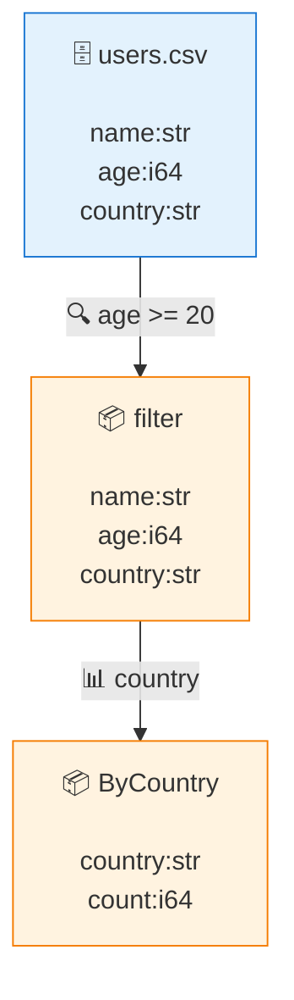

# 成人ユーザーの国別集計

`.riv.md` is the Rivus **Literate** authoring form (§31). It layers three roles
that are never mixed:

- the **YAML frontmatter** above declares config / capability (no semantic
  settings — those stay in the flow);
- this **Markdown prose** is an *enhanced comment*: inert, carries no meaning,
  and round-trips through `rivus fmt`;
- the **`flow` fence** below is the only thing that executes.

Run it, format it, or generate a diagram:

```sh
rivus run     examples/literate.riv.md        # execute the flow
rivus fmt     examples/literate.riv.md         # canonicalize the flow body in place
rivus explain examples/literate.riv.md --write # embed a Mermaid DAG (below)
```

## The flow

A per-cell `#|` option sets the cell name; everything else is ordinary flow
syntax (filter, group-by).

```flow
#| name: adults-by-country
ByCountry:
    open examples/users.csv (name:str age:i64 country:str)
    |? age >= 20
    |# country
;
```

<!-- rivus:begin generated by `rivus explain --write`; edits inside are overwritten -->

```text
ByCountry:
    open examples/users.csv (name:str age:i64 country:str)
    |? $_.age >= 20
    |# country
;
```
<!-- rivus:end -->
