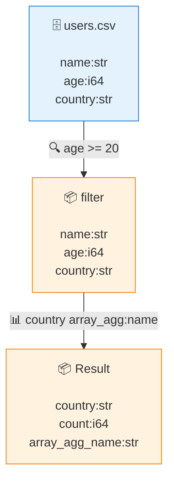

# Array Aggregation and Usability Syntax Usage Demonstration

This document demonstrates the new experimental syntax and aggregation features implemented in the `Rivus-playground` repository:

1. **Optional Leading Pipes**: The `where` stage begins with an optional leading pipe `|`.
2. **Bare-word `group` Keyword**: The group-by stage uses the bare-word `group` keyword instead of the symbolic `|#`.
3. **Array Aggregation (`array_agg`)**: The group-by stage aggregates user names into a JSON array string using the new `array_agg` function.

## Flow Definition

```flow
#| name: array-aggregation-example
Result:
    open examples/users.csv (name:str age:i64 country:str)
    | where age >= 20
    group country array_agg:name
;
```

<!-- rivus:begin generated by `rivus explain --write`; edits inside are overwritten -->

```text
Result:
    open examples/users.csv (name:str age:i64 country:str)
    |? $_.age >= 20
    |# country array_agg:name
;
```
<!-- rivus:end -->
